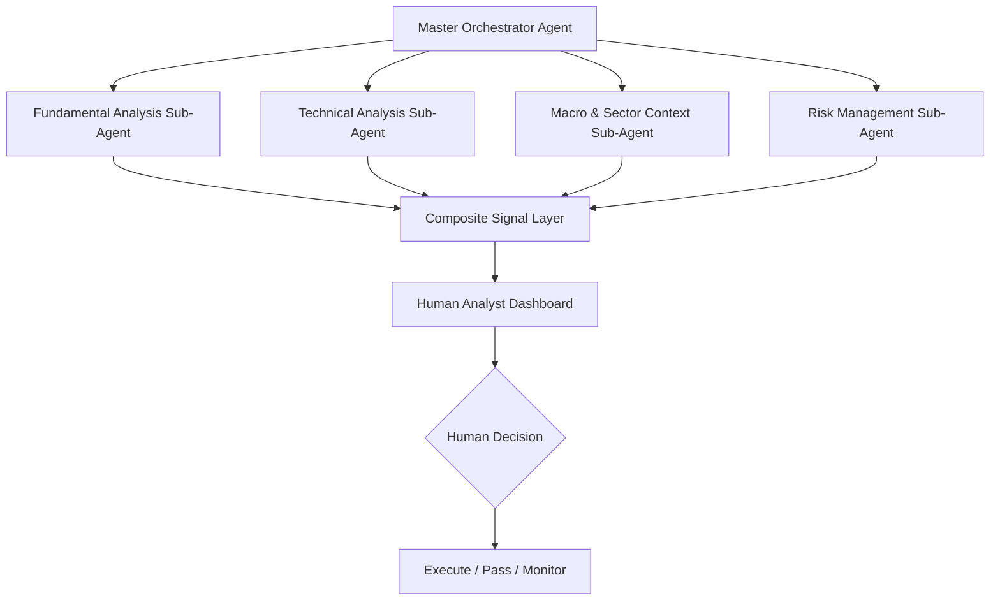
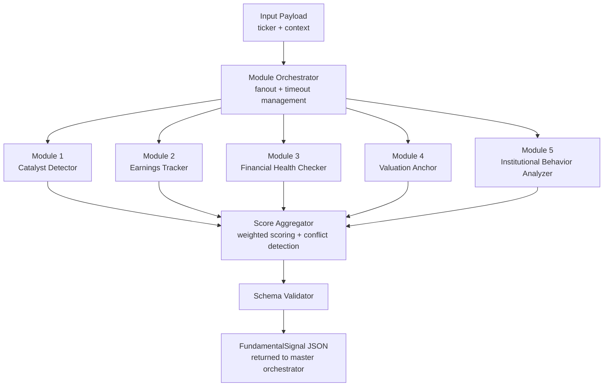
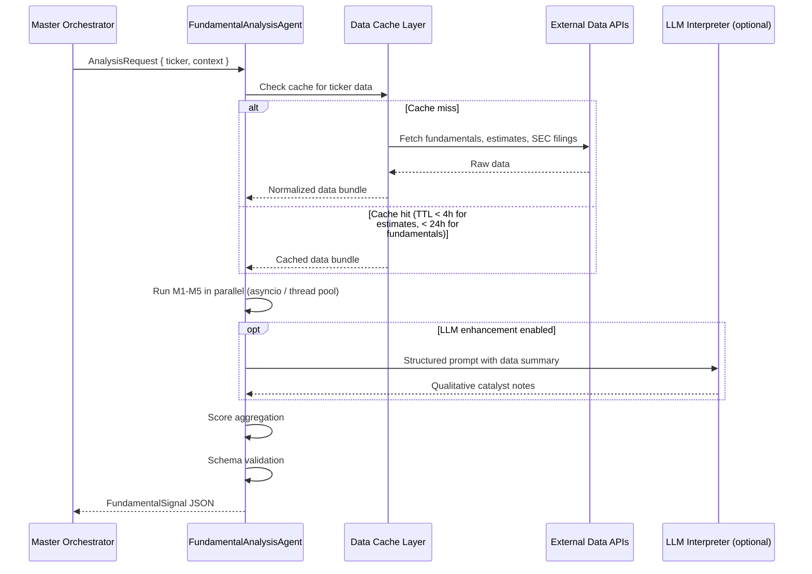
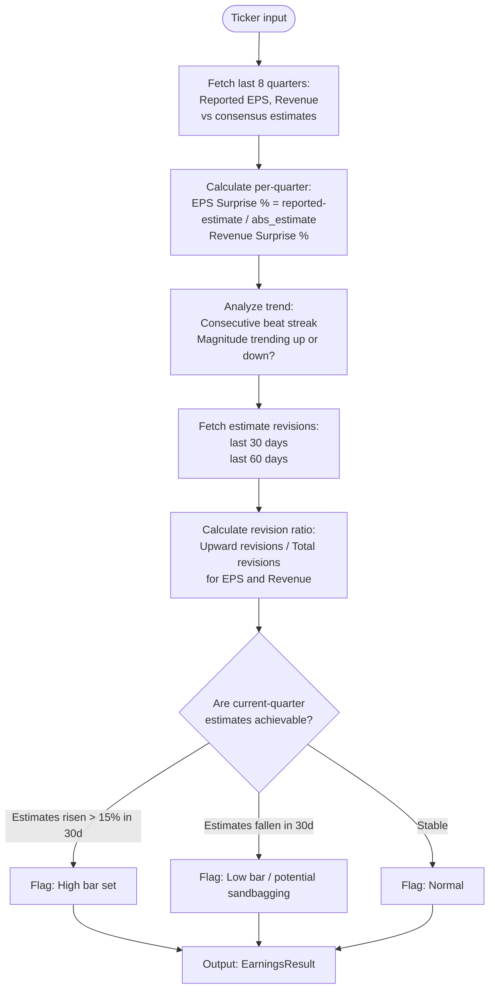
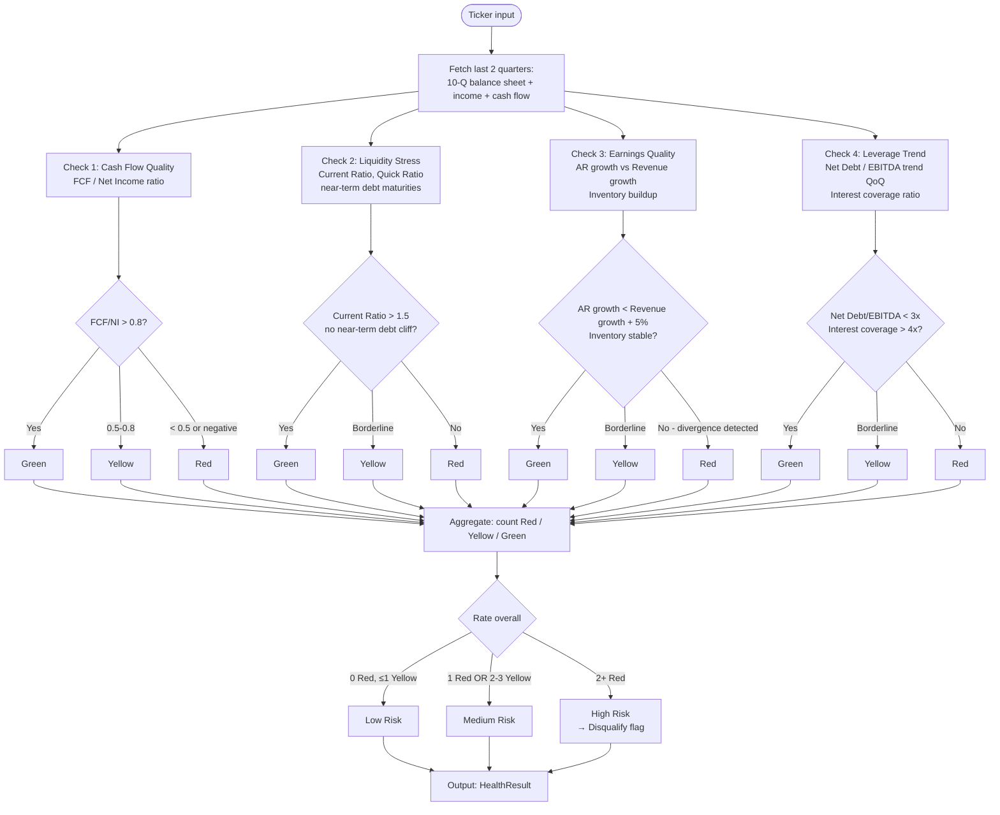
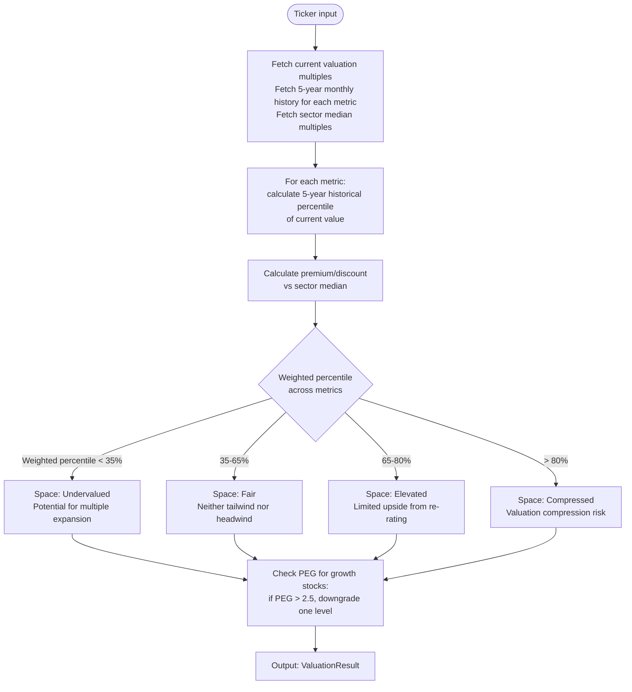
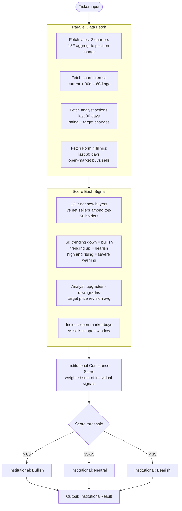
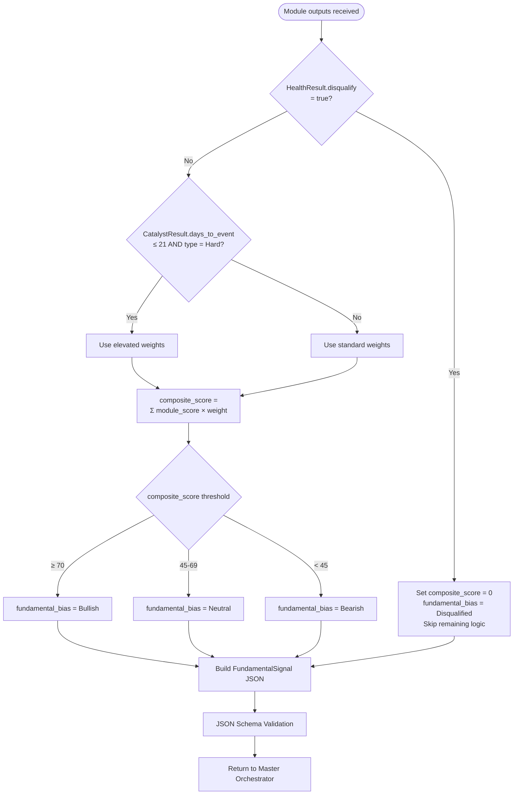

# Fundamental Analysis Sub-Agent Design Document

**Version:** 1.0
**Target Audience:** Coding Agent / AI Developer
**Scope:** US Equity Market — Intermediate Swing Trading Horizon (2 weeks to 2 months)
**Last Updated:** 2026-04-14

---

## 1. Overview

### 1.1 Purpose

This document specifies the design and implementation requirements for the **Fundamental Analysis Sub-Agent** (`FundamentalAnalysisAgent`), one of several specialized sub-agents that form the broader **Intermediate Swing Trading Decision-Support System** for US equities.

The system is explicitly a **human-in-the-loop decision-support tool**, not an automated trading bot. The agent's role is to synthesize fundamental signals into a structured, machine-readable output that feeds the master orchestrator agent, which ultimately presents ranked investment ideas to a human analyst for final decision-making.

### 1.2 Intermediate Swing Trading Context

The target time horizon — **2 weeks to 2 months** — sits between short-term technical trading and medium-term positional investing. This has important implications for fundamental analysis:

- **Long-term metrics are not actionable** in this window. A 10-year DCF model or a decade of ROE history does not drive stock prices over 2 months.
- **Near-term catalysts are everything.** A stock with great fundamentals but no upcoming catalyst will likely not move in the target window.
- **Risk management trumps upside selection.** The primary role of fundamental analysis at this horizon is to screen out "blow-up" risks and confirm that fundamentals are not deteriorating in a way that would undermine a technically-driven trade.
- **Earnings surprises and estimate revisions** are the single most powerful fundamental drivers within this window, backed by decades of anomaly research (Post-Earnings Announcement Drift, Estimate Revision Momentum).

### 1.3 Agent Position in the System



The `FundamentalAnalysisAgent` is a **parallel, stateless sub-agent**. It receives a standardized input payload from the master orchestrator and returns a standardized `FundamentalSignal` JSON object. It has no dependency on the outputs of other sub-agents.

---

## 2. System Requirements

### 2.1 Functional Requirements

| ID | Requirement |
|----|-------------|
| FR-01 | Accept a ticker symbol and optional context payload as input |
| FR-02 | Execute five analysis modules in parallel where possible |
| FR-03 | Produce a structured `FundamentalSignal` output within the defined schema |
| FR-04 | Flag any data gaps or low-confidence assessments explicitly in the output |
| FR-05 | Support batch mode: accept a list of tickers and return a list of signals |
| FR-06 | Return results within 30 seconds for a single ticker under normal conditions |
| FR-07 | Degrade gracefully when a data source is unavailable (partial output with flags) |

### 2.2 Non-Functional Requirements

| ID | Requirement |
|----|-------------|
| NFR-01 | All analysis logic must be deterministic given identical input data |
| NFR-02 | The agent must never produce a buy/sell recommendation — only signal ratings |
| NFR-03 | All scoring rubrics must be documented and version-controlled |
| NFR-04 | LLM-generated interpretations must be clearly separated from rule-based scores |
| NFR-05 | Output JSON must be schema-validated before returning to the orchestrator |
| NFR-06 | Sensitive data (API keys, user credentials) must not appear in logs |

### 2.3 Data Source Dependencies

| Source | Purpose | Required / Optional |
|--------|---------|---------------------|
| Financial data API (e.g., Polygon.io, Tiingo, Alpha Vantage) | Price history, fundamentals, corporate actions | Required |
| Earnings estimates API (e.g., Estimize, Visible Alpha, FactSet) | Consensus EPS/Revenue estimates, revisions | Required |
| SEC EDGAR | 10-Q/10-K filings, 13F institutional holdings, Form 4 (insider trades) | Required |
| Company IR calendar / Earnings Whispers | Earnings dates, investor day dates | Required |
| Optional: News/NLP feed | Qualitative catalyst detection | Optional |

---

## 3. Architecture

### 3.1 Internal Module Architecture

The agent is composed of one orchestration layer and five parallel analysis modules.



### 3.2 Data Flow



---

## 4. Module Specifications

### 4.1 Module 1: Catalyst Detector

**Purpose:** Identify whether a near-term, time-bounded fundamental event exists that could cause a meaningful re-pricing of the stock within the target horizon.

**Design Principle:** A stock with no visible catalyst should receive a heavily penalized composite score, regardless of how strong the other four modules rate it. In swing trading, timing is inseparable from the thesis.

#### 4.1.1 Catalyst Taxonomy

| Category | Examples | Time Certainty |
|----------|----------|---------------|
| Hard Catalyst | Earnings release, FDA decision, investor day, annual meeting | High — date known in advance |
| Soft Catalyst | Industry conference presentation, peer earnings (read-through), macro data release, index rebalance | Medium — recurring but not always confirmed |
| Latent Catalyst | Insider trading window opening, activist investor buildup, short squeeze trigger | Low — inferred, not scheduled |

#### 4.1.2 Detection Logic

```mermaid
flowchart TD
    START([Start: ticker input]) --> FETCH[Fetch IR calendar\nEarnings Whispers + SEC EDGAR]
    FETCH --> CHECK_HARD{Hard catalyst\nwithin 0-60 days?}

    CHECK_HARD -->|Yes| CALC_DAYS[Calculate days_to_event]
    CALC_DAYS --> HIST[Fetch historical avg price move\non same event type]
    HIST --> RATE_HARD[Rate catalyst strength:\nStrong if avg_move > 5%\nMild if 2-5%\nWeak if < 2%]

    CHECK_HARD -->|No| CHECK_SOFT{Soft catalyst\nwithin 0-60 days?}
    CHECK_SOFT -->|Yes| RATE_SOFT[Rate: Mild]
    CHECK_SOFT -->|No| CHECK_LATENT{Latent signals\npresent?]
    CHECK_LATENT -->|Yes| RATE_LATENT[Rate: Weak]
    CHECK_LATENT -->|No| RATE_ABSENT[Rate: Absent]

    RATE_HARD --> EXPECT[Assess expectation load:\nIs the catalyst already priced in?\nCheck options IV vs historical IV]
    EXPECT --> OUT1[Output: CatalystResult]
    RATE_SOFT --> OUT1
    RATE_LATENT --> OUT1
    RATE_ABSENT --> OUT1
```

#### 4.1.3 Output Schema: `CatalystResult`

```typescript
interface CatalystResult {
  rating: "Strong" | "Mild" | "Weak" | "Absent";
  primary_catalyst_type: "Hard" | "Soft" | "Latent" | "None";
  next_event_name: string | null;           // e.g., "Q2 FY2026 Earnings"
  days_to_event: number | null;
  historical_avg_move_pct: number | null;   // average abs price move on this event type
  expectation_load: "Overloaded" | "Neutral" | "Underestimated" | "Unknown";
  // Overloaded = IV spike, whisper numbers well above consensus → beat required to rally
  options_iv_percentile: number | null;     // current IV percentile (0-100)
  catalyst_score: number;                   // 0-100, used by aggregator
  notes: string;
}
```

#### 4.1.4 Scoring Rubric

| Condition | catalyst_score |
|-----------|---------------|
| Strong catalyst, days_to_event ≤ 14, expectation neutral | 90-100 |
| Strong catalyst, days_to_event 15-45, expectation neutral | 75-89 |
| Strong catalyst, any timing, expectation overloaded | 50-65 |
| Mild catalyst | 40-60 |
| Weak / latent catalyst | 20-39 |
| Absent | 0-19 |

---

### 4.2 Module 2: Earnings Tracker

**Purpose:** Assess the trajectory of earnings surprises and analyst estimate revisions. This module captures the **Earnings Momentum** and **Estimate Revision Momentum** factors — two of the most empirically robust return predictors in the intermediate-term window.

**Design Principle:** Do not analyze earnings in isolation. What matters is the *delta* between what the market expects and what the company delivers, and whether expectations are trending up or down.

#### 4.2.1 Analysis Logic



#### 4.2.2 Output Schema: `EarningsResult`

```typescript
interface EarningsResult {
  eps_beat_streak_quarters: number;           // consecutive quarters of EPS beat
  avg_eps_surprise_pct_4q: number;            // average EPS surprise % over last 4 quarters
  avg_revenue_surprise_pct_4q: number;
  eps_revision_ratio_30d: number;             // 0.0 to 1.0 (1.0 = all upward)
  eps_revision_ratio_60d: number;
  revenue_revision_ratio_30d: number;
  current_quarter_bar: "High" | "Normal" | "Low";
  guidance_trend: "Raised" | "Maintained" | "Lowered" | "NoGuidance";
  earnings_momentum: "Accelerating" | "Stable" | "Decelerating";
  earnings_score: number;                     // 0-100
  notes: string;
}
```

#### 4.2.3 Scoring Rubric

| Condition | earnings_score adjustment |
|-----------|--------------------------|
| Beat streak ≥ 4 quarters | +20 |
| avg_eps_surprise > 5% | +15 |
| eps_revision_ratio_30d > 0.7 | +20 |
| eps_revision_ratio_30d < 0.3 | -25 |
| current_quarter_bar = "High" | -10 |
| guidance_trend = "Raised" | +15 |
| guidance_trend = "Lowered" | -30 |
| earnings_momentum = "Accelerating" | +10 |
| earnings_momentum = "Decelerating" | -20 |

Base score starts at 50. Apply adjustments and clamp to [0, 100].

---

### 4.3 Module 3: Financial Health Checker

**Purpose:** Screen for balance sheet and cash flow risks that could cause a fundamental "blow-up" during the holding period. This module functions as a **veto gate**: a `High Risk` rating from this module should trigger a disqualification flag passed to the orchestrator, bypassing the normal scoring pipeline.

**Design Principle:** Focus exclusively on indicators that can materialize as negative price events within 2 months. Do not analyze 10-year capital allocation history.

#### 4.3.1 Health Check Categories



#### 4.3.2 Output Schema: `HealthResult`

```typescript
interface HealthCheckItem {
  name: string;
  value: number | string;
  status: "Green" | "Yellow" | "Red";
  note: string;
}

interface HealthResult {
  overall_rating: "Low" | "Medium" | "High";     // High = veto flag
  disqualify: boolean;                             // true if overall_rating = High
  checks: HealthCheckItem[];                       // one entry per check
  health_score: number;                            // 0-100
  data_staleness_days: number;                     // age of most recent filing used
  notes: string;
}
```

#### 4.3.3 Score Mapping

| overall_rating | health_score range |
|---------------|-------------------|
| Low Risk | 70-100 |
| Medium Risk | 35-69 |
| High Risk | 0-34 |

When `disqualify = true`, the aggregator must set `composite_score = 0` and `fundamental_bias = "Disqualified"` in the final output, regardless of other module scores.

---

### 4.4 Module 4: Valuation Anchor

**Purpose:** Determine whether current valuation provides enough upside headroom for the trade to make sense, and flag if valuation is stretched enough to create a compression risk during the holding period.

**Design Principle:** Use **relative valuation only** (vs historical range and vs sector peers). Do not compute DCF. The relevant question is not "what is this company worth?" but rather "is the market likely to re-rate this stock up or down over the next 2 months?"

#### 4.4.1 Metrics Used

| Metric | Applicable To | Note |
|--------|-------------|------|
| Forward P/E | Profitable companies | Most widely tracked; drives sentiment |
| EV/EBITDA | Capital-intensive sectors | Less distorted by capital structure |
| P/S (Price/Sales) | High-growth, pre-profit | Useful when P/E is infinite |
| PEG Ratio | Growth stocks | P/E ÷ 3-year EPS growth rate; > 2 = expensive |
| P/FCF | Value / mature companies | FCF-based sanity check |

#### 4.4.2 Analysis Logic



#### 4.4.3 Output Schema: `ValuationResult`

```typescript
interface ValuationMetric {
  name: string;
  current_value: number;
  five_year_percentile: number;        // 0-100
  sector_median: number;
  premium_discount_pct: number;        // positive = premium to sector
}

interface ValuationResult {
  space_rating: "Undervalued" | "Fair" | "Elevated" | "Compressed";
  weighted_percentile: number;         // 0-100 across all metrics
  metrics: ValuationMetric[];
  peg_ratio: number | null;
  peg_flag: boolean;                   // true if PEG > 2.5
  valuation_score: number;             // 0-100
  notes: string;
}
```

#### 4.4.4 Scoring Rubric

| space_rating | Base valuation_score |
|-------------|---------------------|
| Undervalued | 80-100 |
| Fair | 55-75 |
| Elevated | 30-54 |
| Compressed | 0-29 |

If `peg_flag = true`, subtract 10 from the base score.

---

### 4.5 Module 5: Institutional Behavior Analyzer

**Purpose:** Detect whether the "smart money" is positioning for or against the thesis. Institutional flows often lead retail price movements by 4-12 weeks, making this module a useful leading indicator for the intermediate swing horizon.

**Design Principle:** Institutional 13F data has a 45-day filing lag, so it must be combined with more real-time proxies: short interest changes, analyst rating changes, and insider open-market transactions.

#### 4.5.1 Signal Sources

| Signal | Update Frequency | Lag | Predictive Value |
|--------|----------------|-----|-----------------|
| 13F Holdings Change | Quarterly | ~45 days | Medium (directional) |
| Short Interest (SI) | Bi-monthly | 14 days | Medium-High |
| Analyst Rating Changes | Real-time | None | Medium |
| Analyst Target Price Changes | Real-time | None | Medium |
| Insider Open-Market Buys | Real-time (Form 4) | 2 business days | High (buy signal) |
| Insider Sales | Real-time (Form 4) | 2 business days | Low (noisy, often pre-planned) |

#### 4.5.2 Analysis Logic



#### 4.5.3 Output Schema: `InstitutionalResult`

```typescript
interface InstitutionalResult {
  institutional_bias: "Bullish" | "Neutral" | "Bearish";

  short_interest_current_pct: number;
  short_interest_30d_change_pct: number;         // negative = shorts covering = bullish
  short_interest_flag: "Elevated" | "Normal" | "Low";

  analyst_upgrades_30d: number;
  analyst_downgrades_30d: number;
  analyst_target_revision_avg_pct: number;        // avg % change in target prices

  insider_buys_60d: number;                       // open-market purchase count
  insider_sells_60d: number;
  insider_signal: "Positive" | "Neutral" | "Negative";

  thirteen_f_net_buyers: number | null;           // top-50 holders: net new buyers
  thirteen_f_data_age_days: number | null;

  institutional_score: number;                    // 0-100
  notes: string;
}
```

---

## 5. Score Aggregator

### 5.1 Weighting System

The aggregator uses a **dynamic weighting scheme** that increases the weight of the Catalyst module when a confirmed hard catalyst is imminent.

#### Standard Weights (no imminent hard catalyst)

| Module | Weight |
|--------|--------|
| Catalyst Detector | 35% |
| Earnings Tracker | 25% |
| Financial Health Checker | 20% |
| Valuation Anchor | 10% |
| Institutional Behavior | 10% |

#### Elevated Catalyst Weights (hard catalyst within ≤ 21 days)

| Module | Weight |
|--------|--------|
| Catalyst Detector | 50% |
| Earnings Tracker | 30% |
| Financial Health Checker | 10% |
| Valuation Anchor | 5% |
| Institutional Behavior | 5% |

### 5.2 Aggregation Logic



### 5.3 Key Risks Extraction

Before returning the final output, the aggregator scans module results for pre-defined risk flags and populates the `key_risks` list. Risk messages must be concise (≤ 120 characters each) and actionable.

| Trigger Condition | Risk Message Template |
|------------------|-----------------------|
| `catalyst.expectation_load = "Overloaded"` | `"Catalyst expectations are elevated; beat threshold is high — gap-down risk on miss"` |
| `earnings.current_quarter_bar = "High"` | `"Consensus estimates have risen sharply in 30d; bar set high for upcoming quarter"` |
| `earnings.guidance_trend = "Lowered"` | `"Management has recently lowered guidance — negative earnings momentum"` |
| `valuation.space_rating = "Compressed"` | `"Valuation at historical high percentile ({n}%); compression risk on any disappointment"` |
| `institutional.short_interest_flag = "Elevated"` and `short_interest_30d_change_pct > 0` | `"Short interest rising; institutional conviction on downside increasing"` |
| `health.overall_rating = "Medium"` | `"Balance sheet shows yellow flags: {specific check names}"` |
| `catalyst.rating = "Absent"` | `"No visible catalyst in the 0-60 day window; timing risk for this horizon"` |

---

## 6. Output Schema

### 6.1 Full `FundamentalSignal` Schema

```typescript
interface FundamentalSignal {
  // Metadata
  schema_version: "1.0";
  ticker: string;
  analysis_timestamp: string;          // ISO 8601 UTC
  target_horizon_days: [14, 60];       // fixed for this agent version

  // Module Outputs
  catalyst: CatalystResult;
  earnings: EarningsResult;
  health: HealthResult;
  valuation: ValuationResult;
  institutional: InstitutionalResult;

  // Aggregated Signal
  weight_scheme_used: "Standard" | "ElevatedCatalyst";
  composite_score: number;             // 0-100; 0 if disqualified
  fundamental_bias: "Bullish" | "Neutral" | "Bearish" | "Disqualified";
  key_risks: string[];                 // ordered, most severe first; max 5 items

  // Data Quality
  data_completeness_pct: number;       // 0-100; < 70 = low confidence
  low_confidence_modules: string[];    // module names with missing/stale data

  // Optional LLM Layer
  llm_summary: string | null;          // ≤ 200 words; null if LLM disabled
}
```

### 6.2 Example Output

```json
{
  "schema_version": "1.0",
  "ticker": "NVDA",
  "analysis_timestamp": "2026-04-14T09:30:00Z",
  "target_horizon_days": [14, 60],

  "catalyst": {
    "rating": "Strong",
    "primary_catalyst_type": "Hard",
    "next_event_name": "Q1 FY2027 Earnings",
    "days_to_event": 18,
    "historical_avg_move_pct": 9.2,
    "expectation_load": "Overloaded",
    "options_iv_percentile": 82,
    "catalyst_score": 60,
    "notes": "Earnings in 18 days. Historical avg move 9.2%. IV at 82nd percentile — market pricing in a large move. Beat required to rally."
  },

  "earnings": {
    "eps_beat_streak_quarters": 6,
    "avg_eps_surprise_pct_4q": 8.3,
    "avg_revenue_surprise_pct_4q": 4.1,
    "eps_revision_ratio_30d": 0.71,
    "eps_revision_ratio_60d": 0.65,
    "revenue_revision_ratio_30d": 0.60,
    "current_quarter_bar": "High",
    "guidance_trend": "Raised",
    "earnings_momentum": "Stable",
    "earnings_score": 72,
    "notes": "Strong beat streak and positive revisions, but bar has been raised materially over the past 30 days."
  },

  "health": {
    "overall_rating": "Low",
    "disqualify": false,
    "checks": [
      { "name": "FCF Quality", "value": 0.91, "status": "Green", "note": "FCF/NI = 0.91, high quality earnings" },
      { "name": "Liquidity", "value": 4.2, "status": "Green", "note": "Current ratio 4.2, no near-term debt maturities" },
      { "name": "Earnings Quality", "value": "AR +3% vs Revenue +18%", "status": "Green", "note": "No divergence detected" },
      { "name": "Leverage", "value": 0.3, "status": "Green", "note": "Net Debt/EBITDA 0.3x, interest coverage 42x" }
    ],
    "health_score": 95,
    "data_staleness_days": 12,
    "notes": "All financial health checks green. Balance sheet is fortress-grade."
  },

  "valuation": {
    "space_rating": "Elevated",
    "weighted_percentile": 73,
    "metrics": [
      { "name": "Forward P/E", "current_value": 38.2, "five_year_percentile": 71, "sector_median": 28.5, "premium_discount_pct": 34.0 },
      { "name": "EV/EBITDA", "current_value": 52.1, "five_year_percentile": 76, "sector_median": 35.0, "premium_discount_pct": 48.9 },
      { "name": "P/FCF", "current_value": 44.3, "five_year_percentile": 68, "sector_median": 32.0, "premium_discount_pct": 38.4 }
    ],
    "peg_ratio": 1.42,
    "peg_flag": false,
    "valuation_score": 40,
    "notes": "Trading at 71-76th percentile across multiples and a 34-49% premium to sector. Growth justifies premium, but limited room for further multiple expansion."
  },

  "institutional": {
    "institutional_bias": "Bullish",
    "short_interest_current_pct": 1.8,
    "short_interest_30d_change_pct": -0.4,
    "short_interest_flag": "Low",
    "analyst_upgrades_30d": 3,
    "analyst_downgrades_30d": 0,
    "analyst_target_revision_avg_pct": 8.2,
    "insider_buys_60d": 1,
    "insider_sells_60d": 0,
    "insider_signal": "Positive",
    "thirteen_f_net_buyers": 12,
    "thirteen_f_data_age_days": 38,
    "institutional_score": 78,
    "notes": "Short interest low and falling. 3 analyst upgrades with avg target +8.2%. One insider buy in the last window."
  },

  "weight_scheme_used": "ElevatedCatalyst",
  "composite_score": 65,
  "fundamental_bias": "Neutral",
  "key_risks": [
    "Catalyst expectations are elevated; beat threshold is high — gap-down risk on miss",
    "Consensus estimates have risen sharply in 30d; bar set high for upcoming quarter",
    "Valuation at historical high percentile (73%); compression risk on any disappointment"
  ],

  "data_completeness_pct": 97,
  "low_confidence_modules": [],
  "llm_summary": null
}
```

---

## 7. Implementation Guide

### 7.1 Recommended Project Structure

```
fundamental_agent/
├── agent.py                    # Entry point: FundamentalAnalysisAgent class
├── orchestrator.py             # Module fan-out, timeout management, aggregation
├── modules/
│   ├── catalyst.py             # Module 1
│   ├── earnings.py             # Module 2
│   ├── health.py               # Module 3
│   ├── valuation.py            # Module 4
│   ├── institutional.py        # Module 5
├── aggregator.py               # Score aggregation + key_risks extraction
├── schemas/
│   ├── input.py                # AnalysisRequest schema (Pydantic)
│   ├── output.py               # FundamentalSignal schema (Pydantic)
│   ├── module_outputs.py       # Per-module result schemas (Pydantic)
├── data/
│   ├── cache.py                # TTL-based data cache
│   ├── fetchers/
│   │   ├── fundamentals.py     # Balance sheet, income statement, cash flow
│   │   ├── estimates.py        # EPS/Revenue consensus and revisions
│   │   ├── ir_calendar.py      # Earnings dates, corporate events
│   │   ├── sec_edgar.py        # 13F, Form 4, 10-Q/10-K
│   │   └── market.py           # Price history, options IV
├── config.py                   # API keys (env vars), thresholds, weights
├── tests/
│   ├── test_modules/           # Unit tests per module
│   ├── test_aggregator.py
│   ├── fixtures/               # Static JSON fixtures for offline testing
│   └── test_integration.py
└── README.md
```

### 7.2 Key Implementation Notes

**Parallelism.** Run all five modules concurrently using `asyncio.gather()` with a configurable timeout per module (default: 25 seconds). If a module times out, mark it as `low_confidence` and continue with partial results rather than failing the entire request.

```python
import asyncio

async def run_all_modules(ticker: str, data: DataBundle) -> dict:
    tasks = [
        asyncio.wait_for(catalyst_module.analyze(ticker, data), timeout=25),
        asyncio.wait_for(earnings_module.analyze(ticker, data), timeout=25),
        asyncio.wait_for(health_module.analyze(ticker, data), timeout=25),
        asyncio.wait_for(valuation_module.analyze(ticker, data), timeout=25),
        asyncio.wait_for(institutional_module.analyze(ticker, data), timeout=25),
    ]
    results = await asyncio.gather(*tasks, return_exceptions=True)
    return process_results(results)
```

**Data caching.** Use a two-tier TTL cache:
- Earnings estimates and analyst revisions: TTL = 4 hours (fast-moving)
- Balance sheet and income statement data: TTL = 24 hours
- IR calendar and earnings dates: TTL = 6 hours
- 13F holdings: TTL = 72 hours (filed quarterly with 45-day lag)

**Schema validation.** Use Pydantic v2 for all input and output schemas. Run `model_validate()` on the final `FundamentalSignal` before returning. Any validation error should be caught, logged with the raw data, and returned as a graceful error response rather than a raw exception.

**Scoring determinism.** All scoring rubrics must be implemented as pure functions with no random or time-dependent elements beyond the input data. The only acceptable source of non-determinism is external data variability.

**LLM layer (optional).** If `config.LLM_ENABLED = True`, the orchestrator passes a structured data summary to a separate LLM call after all modules complete. The LLM is given a strict system prompt that prohibits it from making buy/sell recommendations and limits its output to a factual narrative of ≤ 200 words. The LLM output populates `llm_summary` only and does not affect any numeric score.

### 7.3 Configuration Parameters

All thresholds referenced in this document must be externalized to `config.py` (or a YAML/TOML config file) and not hardcoded in module logic. This enables threshold tuning without code changes.

```python
# config.py (illustrative)

CATALYST_LOOKBACK_DAYS = 60
HARD_CATALYST_STRONG_MOVE_PCT = 5.0     # avg move threshold for "Strong" rating
HARD_CATALYST_MILD_MOVE_PCT = 2.0

EARNINGS_BEAT_STREAK_HIGH = 4            # quarters for significant streak
EARNINGS_REVISION_BULLISH_RATIO = 0.70
EARNINGS_REVISION_BEARISH_RATIO = 0.30
EARNINGS_HIGH_BAR_ESTIMATE_RISE_PCT = 15.0

HEALTH_FCF_NI_GREEN = 0.80
HEALTH_FCF_NI_YELLOW = 0.50
HEALTH_CURRENT_RATIO_GREEN = 1.50
HEALTH_NET_DEBT_EBITDA_MAX = 3.0
HEALTH_INTEREST_COVERAGE_MIN = 4.0

VALUATION_UNDERVALUED_PERCENTILE = 35
VALUATION_ELEVATED_PERCENTILE = 65
VALUATION_COMPRESSED_PERCENTILE = 80
VALUATION_PEG_WARNING = 2.5

INSTITUTIONAL_BULLISH_THRESHOLD = 65
INSTITUTIONAL_BEARISH_THRESHOLD = 35
INSTITUTIONAL_SI_ELEVATED_PCT = 8.0

ELEVATED_CATALYST_DAYS_THRESHOLD = 21   # days_to_event ≤ this → use elevated weights
COMPOSITE_BULLISH_THRESHOLD = 70
COMPOSITE_BEARISH_THRESHOLD = 45

MODULE_TIMEOUT_SECONDS = 25
CACHE_TTL_ESTIMATES_HOURS = 4
CACHE_TTL_FUNDAMENTALS_HOURS = 24
CACHE_TTL_13F_HOURS = 72

LLM_ENABLED = False
LLM_SUMMARY_MAX_WORDS = 200
```

### 7.4 Error Handling Contract

| Error Condition | Behavior |
|----------------|----------|
| Single module timeout | Mark module as `low_confidence`, use score = 50 (neutral) for that module, continue |
| Data source returns empty | Mark module as `low_confidence`, use score = 50, log missing source |
| Data source returns error 5xx | Retry once after 3s, then mark as `low_confidence` |
| `data_completeness_pct < 70` | Set `fundamental_bias = "LowConfidence"` in output, do not discard |
| Schema validation failure on output | Return error response with raw module data attached for debugging |
| All modules fail | Return error response; do not return a partial `FundamentalSignal` |

---

## 8. Testing Requirements

### 8.1 Unit Tests (per module)

Each module must have unit tests covering:
- Happy path with full data
- Graceful degradation with missing fields
- Boundary conditions at all threshold values
- Correct score output for each rating bucket

Use static JSON fixtures in `tests/fixtures/` — never call live APIs in unit tests.

### 8.2 Integration Tests

- End-to-end test for a single ticker with mocked data sources
- Verify `disqualify = true` propagation overrides composite score
- Verify elevated catalyst weight scheme activates correctly
- Verify schema validation catches malformed module outputs

### 8.3 Regression Tests

Maintain a set of 10+ historical ticker snapshots (data frozen at a known date) with expected output values. Run regression tests on every code change to detect scoring drift.

---

## 9. Interfaces

### 9.1 Input: `AnalysisRequest`

```typescript
interface AnalysisRequest {
  ticker: string;                         // e.g., "NVDA"
  as_of_date: string | null;              // ISO 8601; null = use current date
  context: {
    exclude_modules: string[];            // e.g., ["institutional"] to skip
    llm_enabled: boolean;
    target_horizon_override_days: [number, number] | null;
  };
}
```

### 9.2 Batch Input

```typescript
interface BatchAnalysisRequest {
  tickers: string[];                      // max 20 per batch
  as_of_date: string | null;
  context: AnalysisRequest["context"];
}
```

### 9.3 Error Response

```typescript
interface AnalysisError {
  error: true;
  ticker: string;
  error_code: "TIMEOUT" | "DATA_UNAVAILABLE" | "VALIDATION_FAILED" | "ALL_MODULES_FAILED";
  message: string;
  partial_data: object | null;            // raw module results if available
  timestamp: string;
}
```

---

## 10. Appendix: Scoring Summary Reference

| Module | Score Range | Weight (Standard) | Weight (Elevated Catalyst) |
|--------|------------|-------------------|--------------------------|
| Catalyst Detector | 0-100 | 35% | 50% |
| Earnings Tracker | 0-100 | 25% | 30% |
| Financial Health | 0-100 | 20% | 10% |
| Valuation Anchor | 0-100 | 10% | 5% |
| Institutional Behavior | 0-100 | 10% | 5% |
| **Composite** | **0-100** | — | — |

| Composite Score | `fundamental_bias` |
|----------------|-------------------|
| ≥ 70 | Bullish |
| 45-69 | Neutral |
| < 45 | Bearish |
| N/A (health veto) | Disqualified |
| N/A (low data) | LowConfidence |

---

*End of Document*
