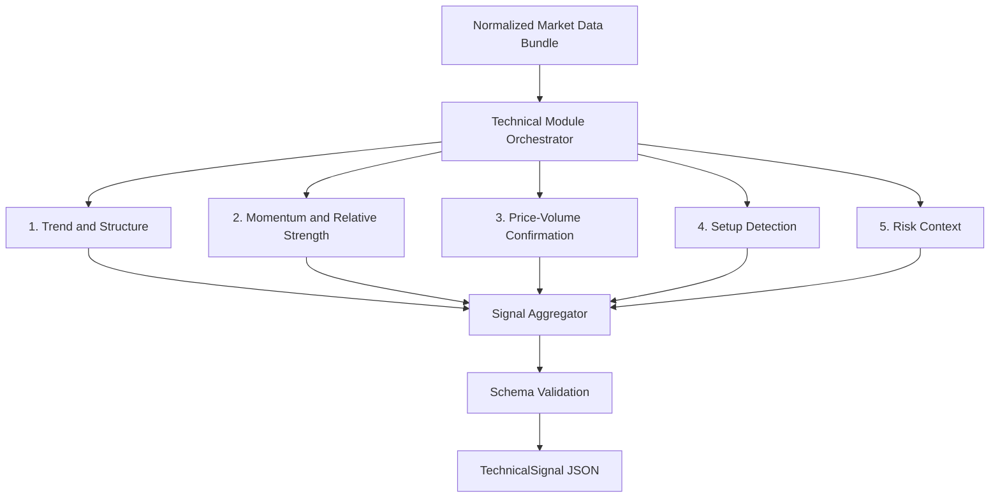

# Technical Analysis Module Design

**Version:** 2.0  
**Target Market:** U.S. equities  
**Time Horizon:** 1 week to 3 months  
**Role in System:** Independent signal-generation module

---

## 1. Purpose

The Technical Analysis Module converts normalized market data into a deterministic `TechnicalSignal` JSON object for downstream use by the system decision layer and trade plan generator.

Its job is to answer four questions:

1. What is the current technical trend state?
2. Is price action supported by momentum and volume?
3. Is there a valid bullish or bearish setup developing?
4. What technical risk conditions should downstream modules respect?

The module is a **signal producer**, not a final decision-maker.

---

## 2. Responsibility Boundary

### In Scope

- Daily and weekly price structure analysis
- Momentum and relative-strength measurement
- Price-volume confirmation
- Rule-based bullish and bearish setup detection
- Technical risk-context generation
- Standardized level extraction for downstream planning

### Out of Scope

- Final system recommendation
- Cross-module weighting against fundamentals, sentiment, or events
- Position sizing
- Full trade-plan construction
- Intraday execution logic
- Manual analyst overrides inside the module

### Design Rules

- The module must be deterministic given the same normalized input data.
- The module must degrade gracefully when optional data is missing.
- The module may output a **technical bias**, but must not output a final buy/sell recommendation.
- The module may output candidate trigger and invalidation levels, but must not output a complete executable trade plan.

---

## 3. Upstream and Downstream Contract

### Upstream Dependency

The module does not fetch raw market data directly. It receives a normalized input bundle from the shared data-retrieval layer.

### Downstream Consumers

- **Decision Layer:** combines technical, fundamental, sentiment, and event signals into system-level bias
- **Trade Plan Generator:** converts technical levels and setup states into bullish and bearish plan drafts
- **Storage Layer:** persists the technical signal for historical comparison

---

## 4. Input Contract

### 4.1 Request Metadata

```json
{
  "ticker": "string",
  "as_of_date": "YYYY-MM-DD",
  "analysis_horizon": "swing_1w_3m"
}
```

### 4.2 Required Market Data

| Field | Requirement | Notes |
|---|---|---|
| Daily OHLCV | Required | At least 252 trading days |
| Weekly OHLCV | Required | At least 52 weeks |
| Benchmark daily OHLCV | Required | 252 trading days; benchmark chosen by shared mapping rule |

### 4.3 Optional Market Data

| Field | Requirement | Usage |
|---|---|---|
| Options implied volatility | Optional | Event-risk and volatility-premium context |
| Options open interest by strike | Optional | Supplemental level clustering |
| Put/call ratio | Optional | Supplemental sentiment context only |
| Short interest and days-to-cover | Optional | Supplemental squeeze and crowding risk |
| Corporate-action calendar tags | Optional | Used only for risk flags, not event scoring |

### 4.4 Benchmark Selection Rule

To keep behavior deterministic, the benchmark is selected by the data layer using this fixed rule:

1. Use mapped sector ETF when a stable sector mapping exists.
2. Otherwise use `SPY`.

The technical module consumes the benchmark symbol as input and does not choose it dynamically.

### 4.5 Missing Data Policy

- Missing required data: return `status = "insufficient_data"` and no technical bias.
- Missing optional data: continue analysis, set related fields to `null`, and add a `data_gaps` entry.
- No manual overrides are allowed inside this module. Any corrected data must enter through the shared normalization layer.

---

## 5. Internal Architecture



The five internal analyzers are parallelizable because they read the same input bundle and produce independent sub-results.

---

## 6. Sub-Module Specifications

### 6.1 Trend and Structure

**Purpose:** Determine primary trend state and extract actionable reference levels.

**Inputs:** Daily OHLCV, Weekly OHLCV

**Indicators**

| Indicator | Parameters |
|---|---|
| Daily SMA | 20, 50, 200 |
| Daily EMA | 10, 21 |
| Weekly SMA | 10, 40 |
| Swing-point detection | 5-bar fractal rule on daily and weekly bars |

**Deterministic Rules**

- `trend_daily = bullish` when close > SMA20 > SMA50 and SMA50 >= SMA200.
- `trend_daily = bearish` when close < SMA20 < SMA50 and SMA50 <= SMA200.
- Otherwise `trend_daily = neutral`.
- `trend_weekly` uses close vs weekly SMA10 and SMA40 with the same ordering logic.
- `key_support` and `key_resistance` are the three nearest confirmed swing levels from the last 52 weeks.

**Outputs**

- `trend_daily`
- `trend_weekly`
- `trend_alignment`
- `ma_stack_state`
- `key_support`
- `key_resistance`

---

### 6.2 Momentum and Relative Strength

**Purpose:** Measure whether trend has internal strength and whether the stock is outperforming its benchmark.

**Inputs:** Daily OHLCV, Benchmark daily OHLCV

**Indicators**

| Indicator | Parameters |
|---|---|
| RSI | 14 |
| MACD | 12, 26, 9 |
| ADX | 14 |
| Relative strength ratio | 63-day stock return / 63-day benchmark return |

**Deterministic Rules**

- `rsi_state = bullish` when RSI >= 60.
- `rsi_state = neutral` when RSI is between 45 and 59.99.
- `rsi_state = bearish` when RSI < 45.
- `macd_state` is derived from MACD line vs signal line and histogram slope.
- `adx_state = strong` when ADX >= 25, `moderate` when 20-24.99, else `weak`.
- `relative_strength_state = leading` when RS >= 1.05, `lagging` when RS <= 0.95, else `in_line`.

**Outputs**

- `rsi_14`
- `rsi_state`
- `macd_state`
- `adx_14`
- `adx_state`
- `relative_strength_63d`
- `relative_strength_state`

---

### 6.3 Price-Volume Confirmation

**Purpose:** Confirm whether price movement is supported by participation rather than drift.

**Inputs:** Daily OHLCV

**Indicators**

| Indicator | Parameters |
|---|---|
| OBV | Standard cumulative OBV |
| Volume moving average | 20-day |
| Breakout / breakdown check | Close vs prior 20-day and 252-day extremes |
| Pullback quality | Pullback-day volume vs 20-day average |

**Deterministic Rules**

- `breakout_confirmed = true` when close exceeds prior 20-day high and volume >= 1.5x 20-day average.
- `breakdown_confirmed = true` when close breaks prior 20-day low and volume >= 1.5x 20-day average.
- `pullback_quality = healthy` only when price pulls back within an existing uptrend and pullback volume <= 0.8x 20-day average.
- OBV divergence compares the two most recent confirmed swing highs or lows within the last 40 sessions.

**Outputs**

- `obv_trend`
- `obv_divergence`
- `breakout_confirmed`
- `breakdown_confirmed`
- `volume_state`
- `pullback_quality`

---

### 6.4 Setup Detection

**Purpose:** Convert raw technical evidence into standardized setup states that downstream modules can plan around.

The module intentionally favors **rule-based setup classes** over subjective classical pattern naming.

**Setup Classes**

| Setup Class | Direction | Core Conditions |
|---|---|---|
| `trend_continuation_breakout` | Bullish | Bullish daily trend, non-bearish weekly trend, confirmed breakout, ADX not weak |
| `constructive_pullback` | Bullish | Bullish weekly trend, price above SMA50, healthy pullback, RSI >= 45 |
| `base_breakout` | Bullish | 20-day range compression, BB width squeeze, breakout confirmed |
| `trend_breakdown` | Bearish | Bearish daily trend, breakdown confirmed, RS lagging |
| `failed_breakout` | Bearish | Prior breakout attempt failed and price closed back below pivot on high volume |
| `none` | Neutral | No valid setup |

**Setup Quality Score**

Each setup receives a 0-100 score:

- Trend structure: 0-30
- Momentum confirmation: 0-20
- Relative strength confirmation: 0-15
- Volume confirmation: 0-20
- Volatility structure and cleanliness: 0-15

Quality bands:

- `high`: 75-100
- `medium`: 55-74
- `low`: below 55

**Outputs**

- `bullish_setup`
- `bullish_setup_quality`
- `bullish_trigger_level`
- `bullish_invalidation_level`
- `bearish_setup`
- `bearish_setup_quality`
- `bearish_trigger_level`
- `bearish_invalidation_level`

---

### 6.5 Risk Context

**Purpose:** Surface technical conditions that should constrain downstream decision and planning logic.

**Inputs:** Daily OHLCV, Benchmark daily OHLCV, optional options and short-interest fields

**Indicators**

| Indicator | Parameters |
|---|---|
| ATR | 14 |
| Beta | 252 trading days vs benchmark |
| Bollinger Band Width | 20-day, 2 standard deviations |
| BB-width percentile | 126-day lookback |
| Max drawdown | Rolling 63-day |
| IV premium | Current IV / 30-day historical volatility when IV is available |

**Deterministic Rules**

- `bb_squeeze = true` when current BB width is at or below the 20th percentile of the last 126 sessions.
- Add `high_beta` flag when beta >= 1.5.
- Add `elevated_drawdown` flag when 63-day max drawdown >= 20%.
- Add `weak_trend_environment` flag when ADX < 20.
- Add `iv_premium` flag when IV/HV >= 1.5.
- Add `crowded_short` flag when short-interest data is present and days-to-cover >= 5.

**Outputs**

- `atr_14`
- `atr_pct`
- `beta_252d`
- `bb_width`
- `bb_squeeze`
- `max_drawdown_63d`
- `iv_hv_ratio`
- `risk_flags`

---

## 7. Aggregation Logic

The aggregator summarizes sub-module outputs into a module-level bias and confidence score. It does **not** issue a final recommendation.

### 7.1 Module-Level Bias

- `bullish` when:
  - weekly trend is not bearish
  - bullish setup quality is at least `medium`
  - bearish setup quality is not higher than bullish setup quality
- `bearish` when:
  - daily trend is bearish
  - bearish setup quality is at least `medium`
  - breakout-confirmation is absent or breakdown-confirmation is present
- otherwise `neutral`

### 7.2 Confidence Score

`confidence_score` is a 0-100 score:

- Trend and structure: 0-30
- Momentum and relative strength: 0-25
- Price-volume confirmation: 0-20
- Setup quality: 0-15
- Risk-condition penalty: subtract up to 10

### 7.3 Escalation Rules

- If required data is missing, return `status = "insufficient_data"`.
- If both bullish and bearish setup quality are `low`, force `technical_bias = "neutral"`.
- If optional risk data is missing, keep the bias unchanged and record `data_gaps`.

---

## 8. Output Schema

```json
{
  "status": "ok | insufficient_data",
  "ticker": "string",
  "as_of_date": "YYYY-MM-DD",
  "benchmark_symbol": "string | null",
  "technical_bias": "bullish | neutral | bearish | unknown",
  "confidence_score": 0,
  "trend_daily": "bullish | neutral | bearish | unknown",
  "trend_weekly": "bullish | neutral | bearish | unknown",
  "trend_alignment": "aligned_bullish | aligned_bearish | mixed | unknown",
  "ma_stack_state": "fully_bullish | partially_bullish | mixed | fully_bearish | unknown",
  "key_support": [0.0],
  "key_resistance": [0.0],
  "rsi_14": 0.0,
  "rsi_state": "bullish | neutral | bearish | unknown",
  "macd_state": "bullish | neutral | bearish | unknown",
  "adx_14": 0.0,
  "adx_state": "strong | moderate | weak | unknown",
  "relative_strength_63d": 0.0,
  "relative_strength_state": "leading | in_line | lagging | unknown",
  "obv_trend": "rising | flat | falling | unknown",
  "obv_divergence": "bullish | bearish | none | unknown",
  "breakout_confirmed": true,
  "breakdown_confirmed": false,
  "volume_state": "expanding | contracting | neutral | unknown",
  "pullback_quality": "healthy | weak | not_applicable | unknown",
  "bullish_setup": "trend_continuation_breakout | constructive_pullback | base_breakout | none | unknown",
  "bullish_setup_quality": "high | medium | low | unknown",
  "bullish_trigger_level": 0.0,
  "bullish_invalidation_level": 0.0,
  "bearish_setup": "trend_breakdown | failed_breakout | none | unknown",
  "bearish_setup_quality": "high | medium | low | unknown",
  "bearish_trigger_level": 0.0,
  "bearish_invalidation_level": 0.0,
  "atr_14": 0.0,
  "atr_pct": 0.0,
  "beta_252d": 0.0,
  "bb_width": 0.0,
  "bb_squeeze": false,
  "max_drawdown_63d": 0.0,
  "iv_hv_ratio": 0.0,
  "risk_flags": ["string"],
  "data_gaps": ["string"],
  "technical_summary": "string"
}
```

### Output Rules

- Fields tied to unavailable optional data must be `null` if the implementation language allows it, or an explicit schema-approved sentinel if it does not.
- `technical_summary` must be generated from structured fields only and must not introduce new judgments not present in the JSON.

---

## 9. Scope Constraints

| In Scope | Out of Scope |
|---|---|
| Daily and weekly timeframe analysis | Intraday and tick-level analysis |
| Bullish and bearish swing setups | High-frequency execution logic |
| Rule-based technical signals | Subjective discretionary chart reading |
| Technical risk context | Position sizing and capital allocation |
| Deterministic level extraction | Manual overrides inside the module |
