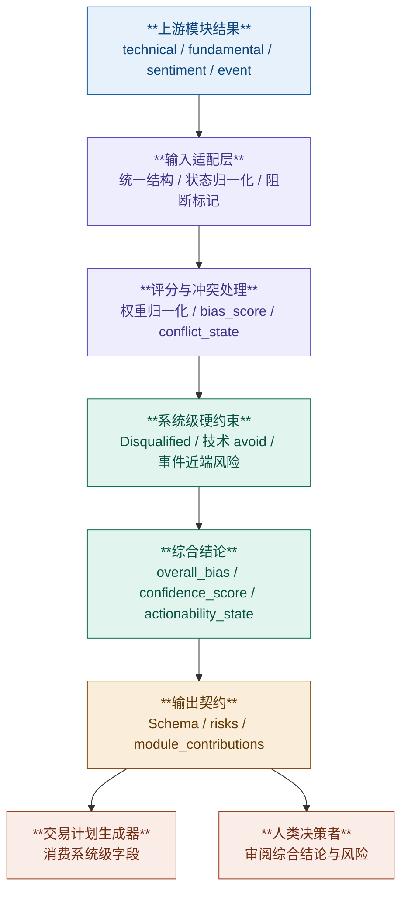

# 决策综合层

## 1. 层目标

决策综合层是全系统唯一允许做**跨模块权重组合**的地方。

它的目标不是重新分析市场，而是把上游模块已经产出的结构化结论汇总成统一、可追溯、可复现的系统级判断，供交易计划生成器和人类决策者消费。

本层服务于以下核心问题：

1. 当前多模块证据汇总后的总体偏向是什么
2. 当前结论是否具备足够置信度
3. 当前是否适合进入交易计划生成阶段

---

## 2. 边界定义

### 2.1 范围内

- 接收 `technical`、`fundamental`、`sentiment`、`event` 的最终聚合结果
- 将各模块结果适配为统一内部结构
- 计算系统级 `bias_score`
- 处理模块缺失、低置信度、未启用和跨模块冲突
- 应用系统级硬约束
- 生成 `overall_bias`、`confidence_score`、`actionability_state`
- 汇总系统级 `risks`

### 2.2 范围外

- 重新计算任何技术、基本面、情绪或事件指标
- 直接读取原始 OHLCV、财报、新闻标题或事件日历
- 覆盖上游模块的原始业务结论
- 直接生成入场价、止损价、止盈价或仓位建议

说明：

- 模块内规则由各模块自己的聚合器负责
- 系统级方向、冲突与执行性判断只允许在本层完成

---

## 3. 上游依赖

决策综合层只读取各模块的**最终聚合结果**，不直接读取原始数据。

当前上游模块如下：

- 技术分析模块
- 基本面分析模块
- 情绪分析模块
- 事件分析模块

本层对上游模块的核心要求：

- 输出必须结构化
- 输出必须可追溯
- 输出必须区分“未启用”和“已启用但失败”
- 输出必须允许低置信度与缺失字段被显式标记

补充口径：

- 当前系统基线默认启用四个核心模块
- `not_enabled` 仍保留为契约兼容状态，但不再把 `event` 模块视为当前阶段的可选能力

详细字段契约、状态适配和错误处理规则见：

- [input_contract.md](/Users/leo/Dev/TradePilot/docs/zh/design/decision_synthesis_layer/input_contract.md:1)

---

## 4. 处理流程



处理顺序固定为：

1. 先做输入适配与状态归一化
2. 再做系统级评分与冲突识别
3. 然后应用硬约束与方向压制
4. 最后生成对下游稳定的输出契约

---

## 5. 文档结构

本目录采用 **1 份总览 + 3 份子文档** 的组织方式。总览只定义层目标、边界、流程和统一对外接口；字段级规则、公式和下游消费约束全部下沉到子文档。

### 5.1 子文档

- [input_contract.md](/Users/leo/Dev/TradePilot/docs/zh/design/decision_synthesis_layer/input_contract.md:1)
  定义上游模块最小输入契约、`normalized_module_signal`、`usable / degraded / excluded / not_enabled` 判定，以及缺失字段、未启用、执行失败和字段非法时的适配规则。
- [scoring_and_conflict.md](/Users/leo/Dev/TradePilot/docs/zh/design/decision_synthesis_layer/scoring_and_conflict.md:1)
  定义系统级配置权重、`enabled_weight_sum / available_weight_sum / available_weight_ratio`、`bias_score`、`aligned / mixed / conflicted`、方向压制、硬约束、`data_completeness_pct` 与 `confidence_score`。
- [output_and_planner_contract.md](/Users/leo/Dev/TradePilot/docs/zh/design/decision_synthesis_layer/output_and_planner_contract.md:1)
  定义最终输出 Schema、`weight_scheme_used`、`module_contributions`、系统级 `risks` 提取规则，以及交易计划生成器的字段白名单与强约束。

### 5.2 阅读顺序

1. 先读本总览，确认决策综合层的职责边界和整体流程
2. 再读 [input_contract.md](/Users/leo/Dev/TradePilot/docs/zh/design/decision_synthesis_layer/input_contract.md:1)，确认输入适配口径
3. 再读 [scoring_and_conflict.md](/Users/leo/Dev/TradePilot/docs/zh/design/decision_synthesis_layer/scoring_and_conflict.md:1)，确认系统级评分与方向规则
4. 最后读 [output_and_planner_contract.md](/Users/leo/Dev/TradePilot/docs/zh/design/decision_synthesis_layer/output_and_planner_contract.md:1)，确认输出与下游消费接口

---

## 6. 子文档分工

### 6.1 输入适配层职责

输入适配层是决策综合层的入口，负责：

- 读取各模块最终聚合结果
- 统一到 `normalized_module_signal`
- 识别 `usable / degraded / excluded / not_enabled`
- 透传系统级 `blocking_flags` 和 `key_risks`

这一层**不做**：

- 跨模块加权
- 冲突判定
- 交易计划生成

详细规则见：

- [input_contract.md](/Users/leo/Dev/TradePilot/docs/zh/design/decision_synthesis_layer/input_contract.md:1)

### 6.2 评分与冲突处理职责

评分与冲突处理层是本层的核心决策逻辑，负责：

- 计算系统级 `bias_score`
- 识别 `aligned / mixed / conflicted`
- 处理 `Disqualified`、技术 `avoid` 和事件近端风险
- 生成最终 `overall_bias`
- 计算 `confidence_score`

这一层**不做**：

- 上游字段逐项适配
- 输出 Schema 组装细节

详细规则见：

- [scoring_and_conflict.md](/Users/leo/Dev/TradePilot/docs/zh/design/decision_synthesis_layer/scoring_and_conflict.md:1)

### 6.3 输出契约层职责

输出契约层负责把系统级结论收敛为稳定、可联调的接口，面向：

- 交易计划生成器
- 上层主调度器
- 审计与观测
- 人类决策者

它负责：

- 定义最终输出 Schema
- 定义 `weight_scheme_used` 与 `module_contributions`
- 定义系统级 `risks`
- 约束交易计划生成器只能消费系统级字段

详细规则见：

- [output_and_planner_contract.md](/Users/leo/Dev/TradePilot/docs/zh/design/decision_synthesis_layer/output_and_planner_contract.md:1)

---

## 7. 模块间契约

### 7.1 上游模块职责

- 技术模块负责提供方向与执行条件
- 基本面模块负责提供背景方向与硬风险约束
- 情绪模块负责提供预期与叙事方向
- 事件模块负责提供催化剂方向与近端事件风险

### 7.2 决策综合层职责

决策综合层是唯一允许做以下事情的层：

- 跨模块权重组合
- 跨模块冲突处理
- 系统级方向压制
- 系统级执行性判断

### 7.3 下游交易计划生成器职责

交易计划生成器只能消费决策综合层已经收敛后的系统级字段，不得：

- 回读任何模块内部原始字段
- 通过 `module_contributions` 反推模块规则
- 用 `bias_score` 自行重算方向

详细消费约束见：

- [output_and_planner_contract.md](/Users/leo/Dev/TradePilot/docs/zh/design/decision_synthesis_layer/output_and_planner_contract.md:1)

---

## 8. 统一输出口径

API 对齐说明：

- 本节定义的是**决策综合层内部稳定输出**
- 该层在公共 HTTP 响应中映射到 `decision_synthesis`
- 对外字段与 API 映射以 [../implementation/01_runtime/response-assembly-and-api-mapping.md](../implementation/01_runtime/response-assembly-and-api-mapping.md) 为准

决策综合层对下游暴露的核心字段固定为：

```json
{
  "overall_bias": "bullish | neutral | bearish",
  "bias_score": "number",
  "confidence_score": "number",
  "actionability_state": "actionable | watch | avoid",
  "conflict_state": "aligned | mixed | conflicted",
  "data_completeness_pct": "number",
  "weight_scheme_used": "object",
  "blocking_flags": ["string"],
  "module_contributions": ["object"],
  "risks": ["string"]
}
```

补充说明：

- 方向判定、冲突、置信度和可执行性必须在同一层产出
- 对下游来说，`overall_bias` 和 `actionability_state` 比模块级原始方向更高优先级
- 详细字段、精度和 `null` 规则见 [output_and_planner_contract.md](/Users/leo/Dev/TradePilot/docs/zh/design/decision_synthesis_layer/output_and_planner_contract.md:1)

---

## 9. 关键设计原则

### 9.1 上游只分析，下游只消费，本层只综合

- 上游模块不做跨模块评分
- 下游交易计划生成器不做跨模块重算
- 决策综合层只负责把模块结论收敛成系统级结论

### 9.2 未启用与失败必须区分

- `not_enabled` 是部署事实
- `excluded` 是运行失败或输入不可用
- 两者不可混用，否则会污染系统级可用性判断

### 9.3 硬约束优先于方向分数

- 基本面 `Disqualified` 可取消净看多资格
- 技术 `setup_state = avoid` 可直接否决执行性
- 事件近端风险可直接否决当前开新仓

### 9.4 输出必须稳定

- 同一输入和同一规则版本下，必须得到相同输出
- 最终 Schema 必须稳定，便于下游实现和联调

---

## 10. 范围约束

### 范围内

- 多模块综合偏向判断
- 系统级风险汇总
- 执行性判断
- 对交易计划生成器的稳定接口

### 范围外

- 自动交易执行
- 实盘仓位管理
- 动态学习型权重调整
- 基于历史收益回归的胜率模型

说明：

- 若未来增加新的并行模块，应作为新的输入模块接入本层
- 不应通过修改现有模块边界来把新信号硬塞进已有模块
