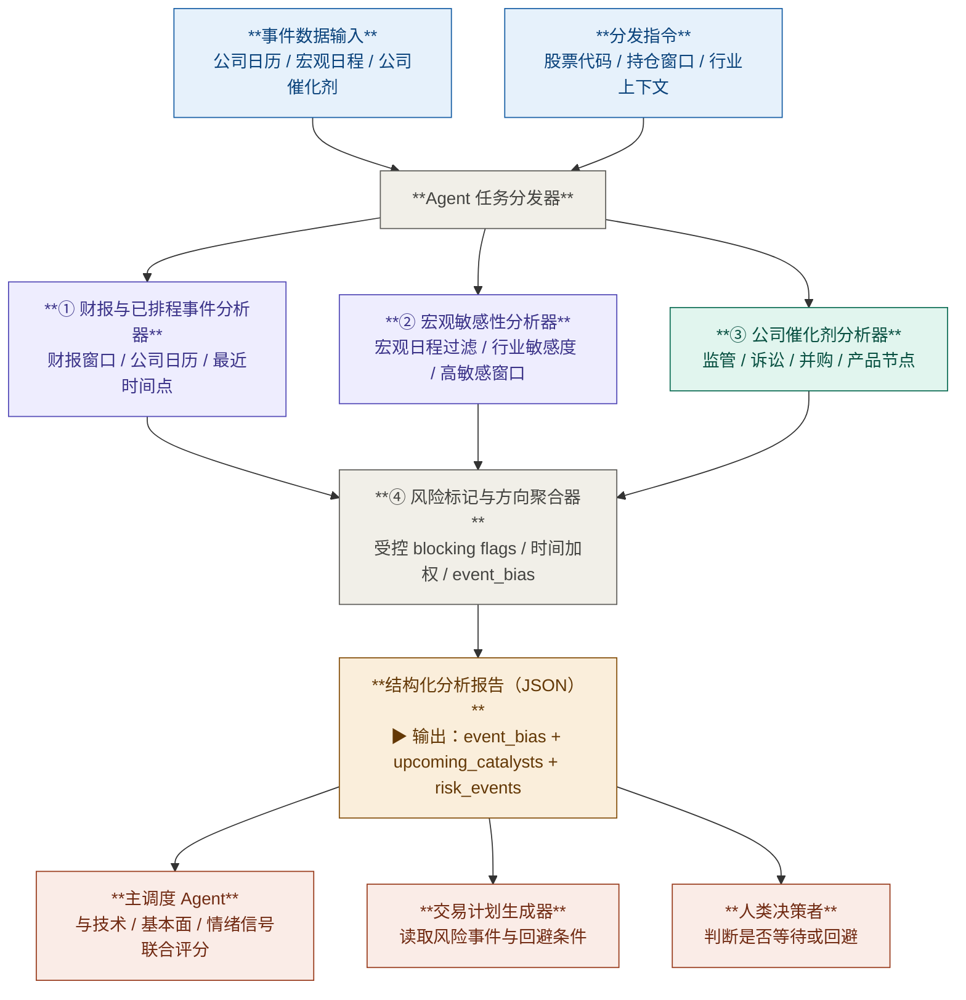

# 事件分析模块

## 1. 模块目标

本模块服务于 **1 周到 3 个月** 的中期交易分析，目标不是预测事件结果本身，而是回答两个更直接的问题：

1. 在当前持仓窗口内，哪些**时间型催化剂**最可能改变交易赔率
2. 哪些**近端事件风险**会让当前新开仓变得不合适，即使方向判断本身并未改变

模块输出必须是 **结构化、可追溯、可复现** 的信号，不直接输出买入 / 卖出指令。

---

## 2. 边界定义

### 范围内

- 财报日期与财报前后高敏感窗口识别
- 宏观敏感事件识别，如 FOMC、CPI、非农、PPI 等
- 公司特定催化剂与风险事件提取，如 FDA 审批、监管裁决、重大诉讼、并购投票、产品发布、Investor Day
- 输出模块级 `event_bias`、`upcoming_catalysts`、`risk_events`、`event_risk_flags`

### 范围外

- 新闻标题基调和市场叙事打分
- 价格趋势、成交量、突破 / 破位等技术信号
- EPS / 营收建模、估值判断或财务兑现验证
- 自动生成交易指令

说明：

- 事件模块识别的是**时间窗口与事件约束**，不是替代情绪模块做新闻偏向判断
- 事件模块可以给出方向性偏向，但前提是方向来自**已知事件状态**，而不是对未知结果的主观猜测
- 近端二元事件通常优先影响 `actionability`，而不是机械改写系统总体方向

---

## 3. 输入域

### 3.1 基础上下文

- `ticker`
- `analysis_window_days`：默认 `[7, 90]`
- `holding_horizon_days`
- `sector` / `industry`
- `primary_market`

### 3.2 公司日历与已排程事件

- 下一次财报日期、盘前 / 盘后标记
- Investor Day、股东大会、并购投票、资本市场日
- 已确认的产品发布、客户大会、临床里程碑、锁定期到期等时间点

每条记录至少包含：

- `event_type`
- `event_date`
- `event_status`：`scheduled | pending | confirmed | completed | rumored`
- `source_name`
- `url`

### 3.3 宏观事件日历与敏感性上下文

- FOMC、CPI、PPI、非农、GDP、零售销售等宏观日程
- 标的对宏观事件的敏感性标签，例如：
  - 高久期成长股对利率决议敏感
  - 半导体对出口管制 / 行业政策敏感
  - 生物科技对 FDA / 临床审评节点敏感

### 3.4 公司特定催化剂与风险事件

- 监管审批或裁决进度
- 重大诉讼、调查或处罚节点
- 并购进展、监管放行、股东投票
- 大额合同、产品发布、管理层重大沟通

每条事件记录至少包含：

- `event_id`
- `event_type`
- `event_state`
- `expected_date`
- `direction_hint`：`positive | negative | neutral | binary | unknown`
- `source_name`
- `url`

### 3.5 数据来源要求

- 每个数据集必须记录：`source`、`fetched_at`、`staleness_days`、`missing_fields`
- 每条事件级记录必须保留 `url` 或唯一来源标识，禁止只保留摘要文本
- 若使用 LLM 做事件抽取或分类，必须记录 `extractor_version`
- 未经确认的传闻不得直接生成 `Bullish / Bearish` 方向，只能保留为低置信度背景信息

---

## 4. 处理流程



---

## 5. 子流程职责

### 5.1 财报与已排程事件分析器

负责：

- 识别最近一次财报日期和盘前 / 盘后属性
- 判断是否处于财报敏感窗口
- 提取已确认的公司排程事件，并按时间远近排序

输出重点：

- `days_to_next_earnings`
- `earnings_window_state`
- `scheduled_catalysts`

### 5.2 宏观敏感性分析器

负责：

- 过滤与当前持仓窗口相关的宏观日程
- 结合行业 / 风格标签判断该标的是否属于高敏感资产
- 识别是否需要触发宏观事件级执行回避

输出重点：

- `macro_event_exposure`
- `macro_sensitivity_level`
- `macro_risk_flag`

### 5.3 公司催化剂分析器

负责：

- 提取公司特定催化剂和风险事件
- 区分 `confirmed`、`pending`、`binary`、`rumored`
- 只基于**已知事件状态**生成方向提示，不预测未知结果

输出重点：

- `company_catalysts`
- `binary_event_state`
- `catalyst_direction`

### 5.4 风险标记与方向聚合器

聚合层是模块内唯一允许做跨子流程组合的地方，负责：

- 统一时间权重和事件优先级
- 生成 `event_bias`
- 提取 `upcoming_catalysts`
- 提取 `risk_events`
- 生成 `event_risk_flags`
- 计算 `data_completeness_pct`
- 标记 `low_confidence_modules`

子流程之间不允许直接消费彼此结论。

---

## 6. 方向与风险判定规则

### 6.1 `event_bias` 生成原则

- `Bullish`：持仓窗口内存在**已确认且方向明确偏正面**的催化剂，且不存在同等级近端负面或二元硬风险压制
- `Bearish`：持仓窗口内存在**已确认且方向明确偏负面**的事件或未解消的重大负面悬而未决事项
- `Neutral`：以下任一情况成立时优先使用
  - 只有财报、监管结果、法院裁决等**未知结果的二元事件**
  - 催化剂多空混合，无法形成清晰单边偏向
  - 关键来源不足，无法合法生成方向结论

约束：

- 不允许因为“市场也许会喜欢这次财报”之类的主观推断生成 `Bullish`
- 未确认传闻、单一社媒线索或无日期的泛泛叙事，不得单独生成方向信号

### 6.2 近端风险优先级

以下风险优先服务于**执行性否决**：

1. `earnings_within_3d`
2. `regulatory_decision_imminent`
3. `binary_event_imminent`
4. `macro_event_high_sensitivity`

说明：

- 这些标记命中时，事件模块应优先把风险写入 `event_risk_flags`
- 是否把系统级 `actionability_state` 压制为 `avoid`，由决策综合层统一完成
- 事件模块本身不直接输出 `actionability_state`

### 6.3 时间权重规则

- `0-3` 天：最高优先级，主要用于执行回避
- `4-14` 天：高优先级，同时影响方向背景和计划等待条件
- `15-90` 天：保留为背景催化剂，不应过度压制当前执行性
- `> 90` 天：默认不进入本模块核心输出

### 6.4 受控系统级风险标记

为对齐决策综合层，`event_risk_flags` 对外只允许输出以下枚举：

- `binary_event_imminent`
- `earnings_within_3d`
- `regulatory_decision_imminent`
- `macro_event_high_sensitivity`

补充约束：

- 模块内部允许保留更细的事件标签，但对外暴露时必须先映射到以上受控枚举
- 若无系统级阻断风险，必须显式输出空数组，不允许输出 `null`

---

## 7. 统一输出口径

API 对齐说明：

- 本节定义的是**事件模块内部聚合输出**
- 该模块在公共 HTTP 响应中映射到 `event_driven_analysis`
- 对外字段与 API 映射以 [../implementation/01_runtime/response-assembly-and-api-mapping.md](../implementation/01_runtime/response-assembly-and-api-mapping.md) 为准

事件模块对上层主调度器暴露的核心字段保持固定：

```json
{
  "event_bias": "Bullish | Neutral | Bearish",
  "upcoming_catalysts": ["string"],
  "risk_events": ["string"],
  "event_summary": "string | null",
  "event_risk_flags": [
    "binary_event_imminent | earnings_within_3d | regulatory_decision_imminent | macro_event_high_sensitivity"
  ],
  "data_completeness_pct": "number",
  "low_confidence_modules": ["string"]
}
```

补充说明：

- `upcoming_catalysts` 用于保留未来 `0-90` 天最值得跟踪的事件背景
- `risk_events` 用于保留会直接影响交易执行或风险收益比的事件
- `event_summary` 必须是对结构化结果的摘要，不允许引入结构化字段之外的新结论
- `risk_events` 与 `event_risk_flags` 不是同义字段：前者面向人类阅读，后者面向系统控制

---

## 8. 关键设计原则

### 8.1 方向判断与执行风险分离

- 事件模块既能输出方向偏向，也能只输出执行层面的回避条件
- 近端硬风险应优先作为执行否决，而不是强制改写长期方向

### 8.2 只基于已知状态，不预测未知结果

- 可以基于“已确认延期”“已发布负面监管文件”“已确定财报 2 天后公布”输出结论
- 不可以基于“这次审批大概率通过”之类的主观推断输出方向

### 8.3 时间敏感性高于数量堆叠

- 一个 2 天后的二元监管裁决，通常比多个 45 天后的弱催化剂更重要
- 聚合时必须优先考虑事件的时间距离和二元性，而不是简单按条数累计

### 8.4 可追溯性

- 每个事件都必须能回溯到明确来源和抓取时间
- 最终方向与风险标记必须能回溯到中间事件对象

### 8.5 确定性优先

- 事件类型、方向提示、风险标记和输出模板必须来自固定规则
- 同一输入和同一规则版本下，必须得到同一输出

---

## 9. 范围约束

| 范围内 | 范围外 |
|---|---|
| 未来 0-90 天事件窗口识别 | 无日期的长期叙事总结 |
| 财报、宏观、监管、诉讼、并购、产品催化剂 | 新闻标题情绪打分 |
| 近端二元风险与执行回避背景 | 对事件结果做主观预测 |
| 模块级结构化事件偏向输出 | 自动生成买卖指令 |
