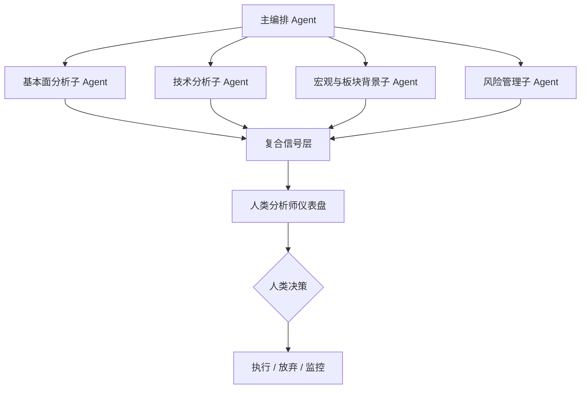
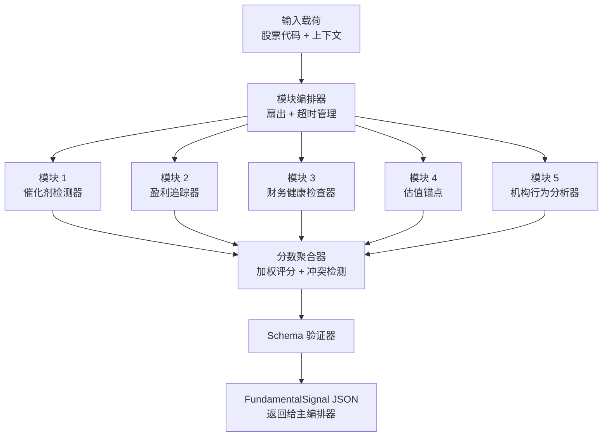
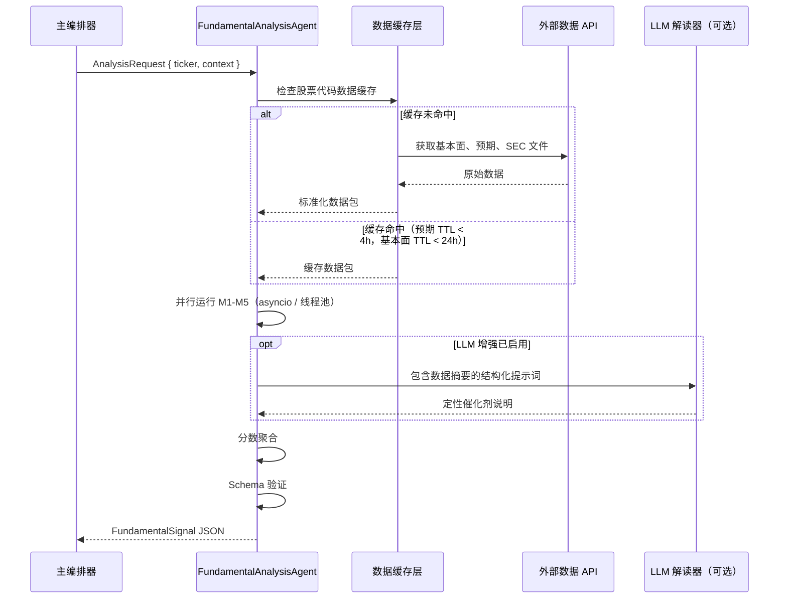
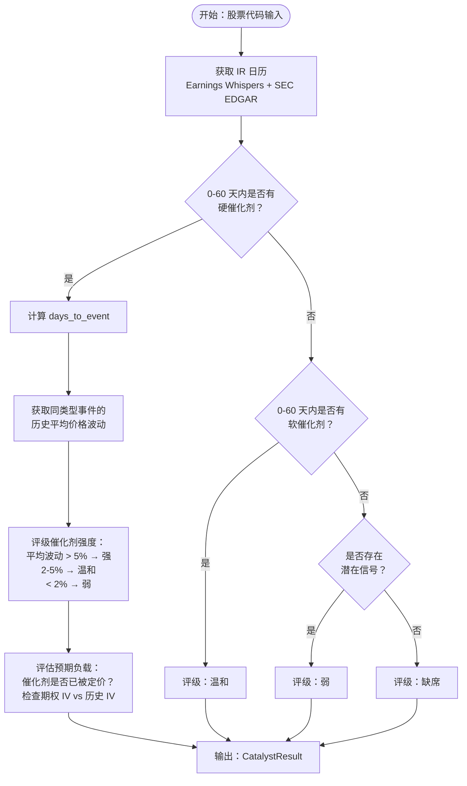
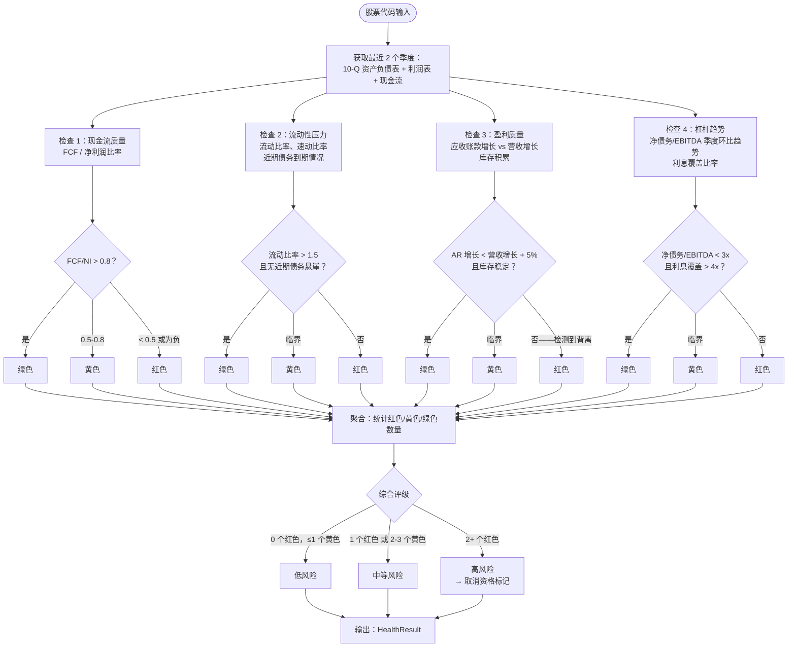
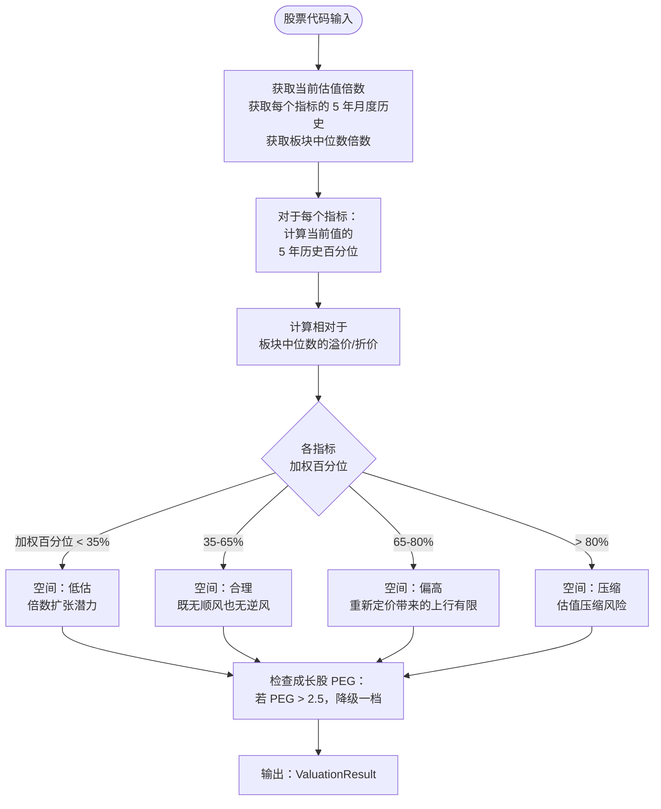
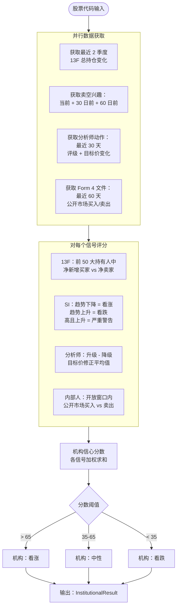
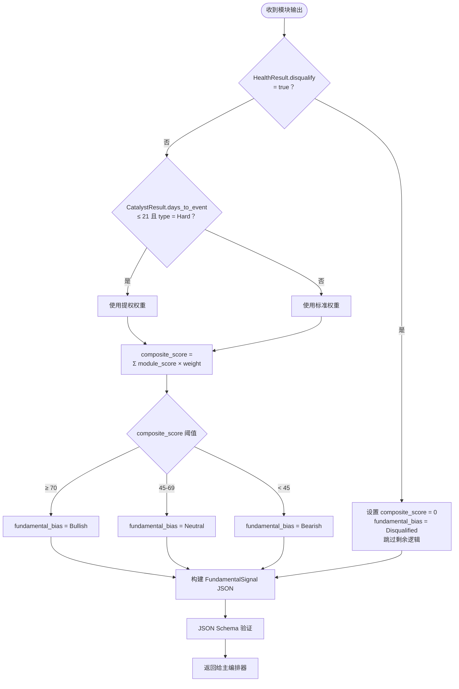

# 基本面分析子 Agent 设计文档

**版本：** 1.0
**目标受众：** 编码 Agent / AI 开发者
**范围：** 美股市场 — 中期波段交易周期（2 周至 2 个月）
**最后更新：** 2026-04-14

---

## 1. 概述

### 1.1 目的

本文档规定了**基本面分析子 Agent**（`FundamentalAnalysisAgent`）的设计和实现要求，它是构成更广泛的**美股中期波段交易决策支持系统**的几个专业子 Agent 之一。

该系统明确定位为**人工介入决策支持工具**，而非自动化交易机器人。该 Agent 的作用是将基本面信号综合为结构化、机器可读的输出，并输入主编排 Agent，由主编排 Agent 最终将排名后的投资想法呈现给人类分析师做出最终决策。

### 1.2 中期波段交易背景

目标时间跨度——**2 周至 2 个月**——介于短期技术交易和中期持仓投资之间。这对基本面分析有重要影响：

- **长期指标在此窗口内不具可操作性。** 10 年 DCF 模型或十年 ROE 历史无法在 2 个月内驱动股价。
- **近期催化剂就是一切。** 基本面良好但没有即将到来催化剂的股票，很可能在目标窗口内不会有所动作。
- **风险管理优先于上行选择。** 在这个时间跨度上，基本面分析的主要作用是筛选"爆雷"风险，并确认基本面没有以会破坏技术驱动交易的方式恶化。
- **盈利超预期和预期修正**是此窗口内最强大的基本面驱动因素，有数十年的异象研究支撑（盈利公告后漂移、预期修正动量）。

### 1.3 Agent 在系统中的位置



`FundamentalAnalysisAgent` 是一个**并行、无状态的子 Agent**。它从主编排 Agent 接收标准化的输入载荷，并返回标准化的 `FundamentalSignal` JSON 对象。它不依赖其他子 Agent 的输出。

---

## 2. 系统需求

### 2.1 功能需求

| ID | 需求 |
|----|------|
| FR-01 | 接受股票代码和可选上下文载荷作为输入 |
| FR-02 | 在可能时并行执行五个分析模块 |
| FR-03 | 按照定义的 schema 生成结构化 `FundamentalSignal` 输出 |
| FR-04 | 在输出中显式标记任何数据缺口或低可信度评估 |
| FR-05 | 支持批量模式：接受股票代码列表并返回信号列表 |
| FR-06 | 在正常条件下，单个股票的结果在 30 秒内返回 |
| FR-07 | 当数据源不可用时优雅降级（带标记的部分输出） |

### 2.2 非功能需求

| ID | 需求 |
|----|------|
| NFR-01 | 在给定相同输入数据的情况下，所有分析逻辑必须是确定性的 |
| NFR-02 | Agent 绝不能产生买入/卖出建议——仅产生信号评级 |
| NFR-03 | 所有评分规则必须有文档记录并进行版本控制 |
| NFR-04 | LLM 生成的解读必须与基于规则的分数明确区分 |
| NFR-05 | 输出 JSON 必须在返回给编排器前经过 schema 验证 |
| NFR-06 | 敏感数据（API 密钥、用户凭据）不得出现在日志中 |

### 2.3 数据源依赖

| 来源 | 用途 | 必需/可选 |
|------|------|-----------|
| 金融数据 API（如 Polygon.io、Tiingo、Alpha Vantage） | 价格历史、基本面、公司行动 | 必需 |
| 盈利预期 API（如 Estimize、Visible Alpha、FactSet） | 共识 EPS/营收预期、修正 | 必需 |
| SEC EDGAR | 10-Q/10-K 文件、13F 机构持仓、Form 4（内部人交易） | 必需 |
| 公司 IR 日历 / Earnings Whispers | 财报日期、投资者日日期 | 必需 |
| 可选：新闻/NLP 信息流 | 定性催化剂检测 | 可选 |

---

## 3. 架构

### 3.1 内部模块架构

Agent 由一个编排层和五个并行分析模块组成。



### 3.2 数据流



---

## 4. 模块规格说明

### 4.1 模块 1：催化剂检测器

**目的：** 识别是否存在近期、有时间边界的基本面事件，可能在目标时间跨度内导致股票的有意义重新定价。

**设计原则：** 无可见催化剂的股票应获得严重惩罚的复合分数，无论其他四个模块的评级多高。在波段交易中，时机与论点密不可分。

#### 4.1.1 催化剂分类

| 类别 | 示例 | 时间确定性 |
|------|------|-----------|
| 硬催化剂 | 财报发布、FDA 决定、投资者日、年度会议 | 高——日期提前已知 |
| 软催化剂 | 行业会议展示、同行财报（推断）、宏观数据发布、指数再平衡 | 中——周期性但不总是确认 |
| 潜在催化剂 | 内部人交易窗口开放、激进投资者建仓、空头轧空触发 | 低——推断，非计划内 |

#### 4.1.2 检测逻辑



#### 4.1.3 输出 Schema：`CatalystResult`

```typescript
interface CatalystResult {
  rating: "Strong" | "Mild" | "Weak" | "Absent";
  primary_catalyst_type: "Hard" | "Soft" | "Latent" | "None";
  next_event_name: string | null;           // 例如，"Q2 FY2026 财报"
  days_to_event: number | null;
  historical_avg_move_pct: number | null;   // 此类事件的平均绝对价格波动
  expectation_load: "Overloaded" | "Neutral" | "Underestimated" | "Unknown";
  // Overloaded = IV 飙升，低语数字远超共识 → 需要超预期才能上涨
  options_iv_percentile: number | null;     // 当前 IV 百分位（0-100）
  catalyst_score: number;                   // 0-100，由聚合器使用
  notes: string;
}
```

#### 4.1.4 评分规则

| 条件 | catalyst_score |
|------|---------------|
| 强催化剂，days_to_event ≤ 14，预期中性 | 90-100 |
| 强催化剂，days_to_event 15-45，预期中性 | 75-89 |
| 强催化剂，任意时机，预期过载 | 50-65 |
| 温和催化剂 | 40-60 |
| 弱/潜在催化剂 | 20-39 |
| 缺席 | 0-19 |

---

### 4.2 模块 2：盈利追踪器

**目的：** 评估盈利超预期和分析师预期修正的轨迹。该模块捕捉**盈利动量**和**预期修正动量**因子——这两个因子是中期窗口内经验最为充分的收益预测因子。

**设计原则：** 不要孤立地分析盈利。重要的是市场预期与公司实际表现之间的*差值*，以及预期是在上升还是下降。

#### 4.2.1 分析逻辑

```mermaid
flowchart TD
    START([股票代码输入]) --> FETCH_Q[获取最近 8 个季度：\n实际 EPS、营收\nvs 共识预期]

    FETCH_Q --> CALC_SURPRISE[计算每季度：\nEPS 超预期% = (实际-预期) / |预期|\n营收超预期%]

    CALC_SURPRISE --> TREND[分析趋势：\n连续超预期连续数\n幅度趋势上升或下降？]

    TREND --> FETCH_REV[获取预期修正：\n最近 30 天\n最近 60 天]

    FETCH_REV --> CALC_REV[计算修正比率：\n上调修正 / 总修正次数\n分别计算 EPS 和营收]

    CALC_REV --> CHECK_LOAD{当季度预期\n是否可实现？}
    CHECK_LOAD -->|预期 30 日内上调 > 15%| HIGH_BAR[标记：高门槛]
    CHECK_LOAD -->|预期 30 日内下调| LOW_BAR[标记：低门槛 / 潜在保守指引]
    CHECK_LOAD -->|稳定| NORMAL[标记：正常]

    HIGH_BAR --> OUT2[输出：EarningsResult]
    LOW_BAR --> OUT2
    NORMAL --> OUT2
```

#### 4.2.2 输出 Schema：`EarningsResult`

```typescript
interface EarningsResult {
  eps_beat_streak_quarters: number;           // 连续超预期季度数
  avg_eps_surprise_pct_4q: number;            // 最近 4 季度平均 EPS 超预期%
  avg_revenue_surprise_pct_4q: number;
  eps_revision_ratio_30d: number;             // 0.0 到 1.0（1.0 = 全部上调）
  eps_revision_ratio_60d: number;
  revenue_revision_ratio_30d: number;
  current_quarter_bar: "High" | "Normal" | "Low";
  guidance_trend: "Raised" | "Maintained" | "Lowered" | "NoGuidance";
  earnings_momentum: "Accelerating" | "Stable" | "Decelerating";
  earnings_score: number;                     // 0-100
  notes: string;
}
```

#### 4.2.3 评分规则

| 条件 | earnings_score 调整 |
|------|---------------------|
| 超预期连续数 ≥ 4 季度 | +20 |
| avg_eps_surprise > 5% | +15 |
| eps_revision_ratio_30d > 0.7 | +20 |
| eps_revision_ratio_30d < 0.3 | -25 |
| current_quarter_bar = "High" | -10 |
| guidance_trend = "Raised" | +15 |
| guidance_trend = "Lowered" | -30 |
| earnings_momentum = "Accelerating" | +10 |
| earnings_momentum = "Decelerating" | -20 |

基础分从 50 开始，应用调整后限制在 [0, 100]。

---

### 4.3 模块 3：财务健康检查器

**目的：** 筛查可能在持仓期内导致基本面"爆雷"的资产负债表和现金流风险。该模块起**否决门**的作用：来自该模块的 `High Risk` 评级应触发传递给编排器的取消资格标记，绕过正常评分流程。

**设计原则：** 专注于可能在 2 个月内触发负面价格事件的指标。不分析 10 年资本配置历史。

#### 4.3.1 健康检查类别



#### 4.3.2 输出 Schema：`HealthResult`

```typescript
interface HealthCheckItem {
  name: string;
  value: number | string;
  status: "Green" | "Yellow" | "Red";
  note: string;
}

interface HealthResult {
  overall_rating: "Low" | "Medium" | "High";     // High = 否决标记
  disqualify: boolean;                             // overall_rating = High 时为 true
  checks: HealthCheckItem[];                       // 每项检查一个条目
  health_score: number;                            // 0-100
  data_staleness_days: number;                     // 使用的最新文件的时效（天）
  notes: string;
}
```

#### 4.3.3 分数映射

| overall_rating | health_score 范围 |
|---------------|------------------|
| 低风险 | 70-100 |
| 中等风险 | 35-69 |
| 高风险 | 0-34 |

当 `disqualify = true` 时，聚合器必须将最终输出中的 `composite_score` 设为 0，并将 `fundamental_bias` 设为 `"Disqualified"`，无论其他模块分数如何。

---

### 4.4 模块 4：估值锚点

**目的：** 确定当前估值是否为交易提供足够的上行空间，并标记估值是否过高以至于在持仓期内产生压缩风险。

**设计原则：** 仅使用**相对估值**（相对于历史区间和板块同行）。不计算 DCF。相关问题不是"这家公司值多少钱？"而是"市场是否可能在未来 2 个月内对这只股票重新定价——向上还是向下？"

#### 4.4.1 使用的指标

| 指标 | 适用对象 | 说明 |
|------|---------|------|
| 预期 P/E | 盈利公司 | 跟踪最广泛；驱动情绪 |
| EV/EBITDA | 资本密集型行业 | 较少受资本结构扭曲 |
| P/S（市销率） | 高增长、未盈利公司 | P/E 为无穷大时有用 |
| PEG 比率 | 成长股 | P/E ÷ 3 年 EPS 增长率；> 2 = 昂贵 |
| P/FCF | 价值/成熟公司 | 基于自由现金流的合理性检验 |

#### 4.4.2 分析逻辑



#### 4.4.3 输出 Schema：`ValuationResult`

```typescript
interface ValuationMetric {
  name: string;
  current_value: number;
  five_year_percentile: number;        // 0-100
  sector_median: number;
  premium_discount_pct: number;        // 正数 = 相对板块溢价
}

interface ValuationResult {
  space_rating: "Undervalued" | "Fair" | "Elevated" | "Compressed";
  weighted_percentile: number;         // 所有指标的 0-100 加权
  metrics: ValuationMetric[];
  peg_ratio: number | null;
  peg_flag: boolean;                   // PEG > 2.5 时为 true
  valuation_score: number;             // 0-100
  notes: string;
}
```

#### 4.4.4 评分规则

| space_rating | 基础 valuation_score |
|-------------|---------------------|
| 低估 | 80-100 |
| 合理 | 55-75 |
| 偏高 | 30-54 |
| 压缩 | 0-29 |

若 `peg_flag = true`，从基础分中减去 10。

---

### 4.5 模块 5：机构行为分析器

**目的：** 检测"聪明钱"是否在为或反对论点进行布局。机构资金流向通常比散户价格走势提前 4-12 周，使该模块成为中期波段时间跨度的有用领先指标。

**设计原则：** 机构 13F 数据有 45 天的申报滞后，因此必须与更实时的代理指标结合：卖空兴趣变化、分析师评级变化和内部人人公开市场交易。

#### 4.5.1 信号来源

| 信号 | 更新频率 | 滞后 | 预测价值 |
|------|---------|------|---------|
| 13F 持仓变化 | 季度 | ~45 天 | 中（方向性） |
| 卖空兴趣（SI） | 每两月 | 14 天 | 中高 |
| 分析师评级变化 | 实时 | 无 | 中 |
| 分析师目标价变化 | 实时 | 无 | 中 |
| 内部人公开市场买入 | 实时（Form 4） | 2 个工作日 | 高（买入信号） |
| 内部人卖出 | 实时（Form 4） | 2 个工作日 | 低（噪音大，通常为预先计划） |

#### 4.5.2 分析逻辑



#### 4.5.3 输出 Schema：`InstitutionalResult`

```typescript
interface InstitutionalResult {
  institutional_bias: "Bullish" | "Neutral" | "Bearish";

  short_interest_current_pct: number;
  short_interest_30d_change_pct: number;         // 负数 = 空头回补 = 看涨
  short_interest_flag: "Elevated" | "Normal" | "Low";

  analyst_upgrades_30d: number;
  analyst_downgrades_30d: number;
  analyst_target_revision_avg_pct: number;        // 目标价变化的平均%

  insider_buys_60d: number;                       // 公开市场购买次数
  insider_sells_60d: number;
  insider_signal: "Positive" | "Neutral" | "Negative";

  thirteen_f_net_buyers: number | null;           // 前 50 大持有人：净新增买家
  thirteen_f_data_age_days: number | null;

  institutional_score: number;                    // 0-100
  notes: string;
}
```

---

## 5. 分数聚合器

### 5.1 权重体系

聚合器使用**动态权重方案**，当确认的硬催化剂即将到来时，增加催化剂模块的权重。

#### 标准权重（无即将到来的硬催化剂）

| 模块 | 权重 |
|------|------|
| 催化剂检测器 | 35% |
| 盈利追踪器 | 25% |
| 财务健康检查器 | 20% |
| 估值锚点 | 10% |
| 机构行为 | 10% |

#### 催化剂提权权重（硬催化剂 ≤ 21 天内）

| 模块 | 权重 |
|------|------|
| 催化剂检测器 | 50% |
| 盈利追踪器 | 30% |
| 财务健康检查器 | 10% |
| 估值锚点 | 5% |
| 机构行为 | 5% |

### 5.2 聚合逻辑



### 5.3 关键风险提取

在返回最终输出之前，聚合器扫描模块结果中的预定义风险标记，并填充 `key_risks` 列表。风险消息必须简洁（每条 ≤ 120 个字符）且可操作。

| 触发条件 | 风险消息模板 |
|---------|------------|
| `catalyst.expectation_load = "Overloaded"` | `"催化剂预期过高；达标门槛高——未达预期时有跳空下跌风险"` |
| `earnings.current_quarter_bar = "High"` | `"共识预期在 30 天内大幅上调；当季门槛已设得很高"` |
| `earnings.guidance_trend = "Lowered"` | `"管理层最近下调指引——盈利动量为负"` |
| `valuation.space_rating = "Compressed"` | `"估值处于历史高百分位（{n}%）；任何失望都有压缩风险"` |
| `institutional.short_interest_flag = "Elevated"` 且 `short_interest_30d_change_pct > 0` | `"卖空兴趣上升；机构对下行的信念在增加"` |
| `health.overall_rating = "Medium"` | `"资产负债表出现黄色标记：{具体检查名称}"` |
| `catalyst.rating = "Absent"` | `"0-60 天窗口内无可见催化剂；此时间跨度存在时机风险"` |

---

## 6. 输出 Schema

### 6.1 完整 `FundamentalSignal` Schema

```typescript
interface FundamentalSignal {
  // 元数据
  schema_version: "1.0";
  ticker: string;
  analysis_timestamp: string;          // ISO 8601 UTC
  target_horizon_days: [14, 60];       // 此 Agent 版本固定

  // 模块输出
  catalyst: CatalystResult;
  earnings: EarningsResult;
  health: HealthResult;
  valuation: ValuationResult;
  institutional: InstitutionalResult;

  // 聚合信号
  weight_scheme_used: "Standard" | "ElevatedCatalyst";
  composite_score: number;             // 0-100；取消资格时为 0
  fundamental_bias: "Bullish" | "Neutral" | "Bearish" | "Disqualified";
  key_risks: string[];                 // 按严重程度排序，最严重在前；最多 5 条

  // 数据质量
  data_completeness_pct: number;       // 0-100；< 70 = 低可信度
  low_confidence_modules: string[];    // 数据缺失/过时的模块名称

  // 可选 LLM 层
  llm_summary: string | null;          // ≤ 200 字；LLM 禁用时为 null
}
```

### 6.2 示例输出

```json
{
  "schema_version": "1.0",
  "ticker": "NVDA",
  "analysis_timestamp": "2026-04-14T09:30:00Z",
  "target_horizon_days": [14, 60],

  "catalyst": {
    "rating": "Strong",
    "primary_catalyst_type": "Hard",
    "next_event_name": "Q1 FY2027 财报",
    "days_to_event": 18,
    "historical_avg_move_pct": 9.2,
    "expectation_load": "Overloaded",
    "options_iv_percentile": 82,
    "catalyst_score": 60,
    "notes": "财报在 18 天后。历史平均波动 9.2%。IV 处于第 82 百分位——市场定价了大幅波动。需要超预期才能上涨。"
  },

  "earnings": {
    "eps_beat_streak_quarters": 6,
    "avg_eps_surprise_pct_4q": 8.3,
    "avg_revenue_surprise_pct_4q": 4.1,
    "eps_revision_ratio_30d": 0.71,
    "eps_revision_ratio_60d": 0.65,
    "revenue_revision_ratio_30d": 0.60,
    "current_quarter_bar": "High",
    "guidance_trend": "Raised",
    "earnings_momentum": "Stable",
    "earnings_score": 72,
    "notes": "强劲的超预期连续记录和正向修正，但过去 30 天门槛已被大幅提高。"
  },

  "health": {
    "overall_rating": "Low",
    "disqualify": false,
    "checks": [
      { "name": "现金流质量", "value": 0.91, "status": "Green", "note": "FCF/NI = 0.91，高质量盈利" },
      { "name": "流动性", "value": 4.2, "status": "Green", "note": "流动比率 4.2，无近期债务到期" },
      { "name": "盈利质量", "value": "AR +3% vs 营收 +18%", "status": "Green", "note": "未检测到背离" },
      { "name": "杠杆", "value": 0.3, "status": "Green", "note": "净债务/EBITDA 0.3x，利息覆盖 42x" }
    ],
    "health_score": 95,
    "data_staleness_days": 12,
    "notes": "所有财务健康检查均为绿色。资产负债表堪称堡垒级别。"
  },

  "valuation": {
    "space_rating": "Elevated",
    "weighted_percentile": 73,
    "metrics": [
      { "name": "预期 P/E", "current_value": 38.2, "five_year_percentile": 71, "sector_median": 28.5, "premium_discount_pct": 34.0 },
      { "name": "EV/EBITDA", "current_value": 52.1, "five_year_percentile": 76, "sector_median": 35.0, "premium_discount_pct": 48.9 },
      { "name": "P/FCF", "current_value": 44.3, "five_year_percentile": 68, "sector_median": 32.0, "premium_discount_pct": 38.4 }
    ],
    "peg_ratio": 1.42,
    "peg_flag": false,
    "valuation_score": 40,
    "notes": "各倍数处于第 71-76 百分位，较板块溢价 34-49%。增长为溢价提供了理由，但进一步倍数扩张空间有限。"
  },

  "institutional": {
    "institutional_bias": "Bullish",
    "short_interest_current_pct": 1.8,
    "short_interest_30d_change_pct": -0.4,
    "short_interest_flag": "Low",
    "analyst_upgrades_30d": 3,
    "analyst_downgrades_30d": 0,
    "analyst_target_revision_avg_pct": 8.2,
    "insider_buys_60d": 1,
    "insider_sells_60d": 0,
    "insider_signal": "Positive",
    "thirteen_f_net_buyers": 12,
    "thirteen_f_data_age_days": 38,
    "institutional_score": 78,
    "notes": "卖空兴趣低且下降。3 次分析师升级，平均目标价 +8.2%。过去窗口内有一次内部人买入。"
  },

  "weight_scheme_used": "ElevatedCatalyst",
  "composite_score": 65,
  "fundamental_bias": "Neutral",
  "key_risks": [
    "催化剂预期过高；达标门槛高——未达预期时有跳空下跌风险",
    "共识预期在 30 天内大幅上调；当季门槛已设得很高",
    "估值处于历史高百分位（73%）；任何失望都有压缩风险"
  ],

  "data_completeness_pct": 97,
  "low_confidence_modules": [],
  "llm_summary": null
}
```

---

## 7. 实现指南

### 7.1 推荐项目结构

```
fundamental_agent/
├── agent.py                    # 入口点：FundamentalAnalysisAgent 类
├── orchestrator.py             # 模块扇出、超时管理、聚合
├── modules/
│   ├── catalyst.py             # 模块 1
│   ├── earnings.py             # 模块 2
│   ├── health.py               # 模块 3
│   ├── valuation.py            # 模块 4
│   ├── institutional.py        # 模块 5
├── aggregator.py               # 分数聚合 + key_risks 提取
├── schemas/
│   ├── input.py                # AnalysisRequest schema（Pydantic）
│   ├── output.py               # FundamentalSignal schema（Pydantic）
│   ├── module_outputs.py       # 每个模块的结果 schema（Pydantic）
├── data/
│   ├── cache.py                # 基于 TTL 的数据缓存
│   ├── fetchers/
│   │   ├── fundamentals.py     # 资产负债表、利润表、现金流
│   │   ├── estimates.py        # EPS/营收共识和修正
│   │   ├── ir_calendar.py      # 财报日期、公司事件
│   │   ├── sec_edgar.py        # 13F、Form 4、10-Q/10-K
│   │   └── market.py           # 价格历史、期权 IV
├── config.py                   # API 密钥（环境变量）、阈值、权重
├── tests/
│   ├── test_modules/           # 每个模块的单元测试
│   ├── test_aggregator.py
│   ├── fixtures/               # 用于离线测试的静态 JSON fixture
│   └── test_integration.py
└── README.md
```

### 7.2 关键实现说明

**并行性。** 使用 `asyncio.gather()` 并发运行所有五个模块，每个模块设置可配置的超时时间（默认：25 秒）。如果模块超时，将其标记为 `low_confidence` 并继续处理部分结果，而非让整个请求失败。

```python
import asyncio

async def run_all_modules(ticker: str, data: DataBundle) -> dict:
    tasks = [
        asyncio.wait_for(catalyst_module.analyze(ticker, data), timeout=25),
        asyncio.wait_for(earnings_module.analyze(ticker, data), timeout=25),
        asyncio.wait_for(health_module.analyze(ticker, data), timeout=25),
        asyncio.wait_for(valuation_module.analyze(ticker, data), timeout=25),
        asyncio.wait_for(institutional_module.analyze(ticker, data), timeout=25),
    ]
    results = await asyncio.gather(*tasks, return_exceptions=True)
    return process_results(results)
```

**数据缓存。** 使用两层 TTL 缓存：
- 盈利预期和分析师修正：TTL = 4 小时（变化快速）
- 资产负债表和利润表数据：TTL = 24 小时
- IR 日历和财报日期：TTL = 6 小时
- 13F 持仓：TTL = 72 小时（季度申报，有 45 天滞后）

**Schema 验证。** 对所有输入和输出 schema 使用 Pydantic v2。在返回前对最终 `FundamentalSignal` 运行 `model_validate()`。任何验证错误都应被捕获、与原始数据一起记录日志，并作为优雅的错误响应返回，而非原始异常。

**评分确定性。** 所有评分规则必须实现为纯函数，除输入数据外不含随机或时间依赖元素。唯一可接受的不确定性来源是外部数据变化。

**LLM 层（可选）。** 若 `config.LLM_ENABLED = True`，编排器在所有模块完成后将结构化数据摘要传递给独立的 LLM 调用。LLM 被给予严格的系统提示词，禁止其提出买入/卖出建议，并将输出限制在 ≤ 200 字的事实性叙述。LLM 输出仅填充 `llm_summary`，不影响任何数字分数。

### 7.3 配置参数

本文档中引用的所有阈值必须外部化到 `config.py`（或 YAML/TOML 配置文件）中，不得在模块逻辑中硬编码。这样可以在不修改代码的情况下调整阈值。

```python
# config.py（示例）

CATALYST_LOOKBACK_DAYS = 60
HARD_CATALYST_STRONG_MOVE_PCT = 5.0     # "强"评级的平均波动阈值
HARD_CATALYST_MILD_MOVE_PCT = 2.0

EARNINGS_BEAT_STREAK_HIGH = 4            # 重要连续数的季度数
EARNINGS_REVISION_BULLISH_RATIO = 0.70
EARNINGS_REVISION_BEARISH_RATIO = 0.30
EARNINGS_HIGH_BAR_ESTIMATE_RISE_PCT = 15.0

HEALTH_FCF_NI_GREEN = 0.80
HEALTH_FCF_NI_YELLOW = 0.50
HEALTH_CURRENT_RATIO_GREEN = 1.50
HEALTH_NET_DEBT_EBITDA_MAX = 3.0
HEALTH_INTEREST_COVERAGE_MIN = 4.0

VALUATION_UNDERVALUED_PERCENTILE = 35
VALUATION_ELEVATED_PERCENTILE = 65
VALUATION_COMPRESSED_PERCENTILE = 80
VALUATION_PEG_WARNING = 2.5

INSTITUTIONAL_BULLISH_THRESHOLD = 65
INSTITUTIONAL_BEARISH_THRESHOLD = 35
INSTITUTIONAL_SI_ELEVATED_PCT = 8.0

ELEVATED_CATALYST_DAYS_THRESHOLD = 21   # days_to_event ≤ 此值 → 使用提权权重
COMPOSITE_BULLISH_THRESHOLD = 70
COMPOSITE_BEARISH_THRESHOLD = 45

MODULE_TIMEOUT_SECONDS = 25
CACHE_TTL_ESTIMATES_HOURS = 4
CACHE_TTL_FUNDAMENTALS_HOURS = 24
CACHE_TTL_13F_HOURS = 72

LLM_ENABLED = False
LLM_SUMMARY_MAX_WORDS = 200
```

### 7.4 错误处理约定

| 错误条件 | 行为 |
|---------|------|
| 单个模块超时 | 将该模块标记为 `low_confidence`，该模块分数使用 50（中性），继续处理 |
| 数据源返回空数据 | 将模块标记为 `low_confidence`，分数使用 50，记录缺失来源 |
| 数据源返回 5xx 错误 | 3 秒后重试一次，然后标记为 `low_confidence` |
| `data_completeness_pct < 70` | 在输出中设置 `fundamental_bias = "LowConfidence"`，不丢弃数据 |
| 输出 schema 验证失败 | 返回附带原始模块数据的错误响应，用于调试 |
| 所有模块失败 | 返回错误响应；不返回部分 `FundamentalSignal` |

---

## 8. 测试要求

### 8.1 单元测试（每个模块）

每个模块必须有覆盖以下情况的单元测试：
- 完整数据的正常路径
- 缺失字段时的优雅降级
- 所有阈值处的边界条件
- 每个评级分组的正确分数输出

在 `tests/fixtures/` 中使用静态 JSON fixture——单元测试中绝不调用真实 API。

### 8.2 集成测试

- 使用模拟数据源的单股票端到端测试
- 验证 `disqualify = true` 传播能正确覆盖复合分数
- 验证催化剂提权权重方案能正确激活
- 验证 schema 验证能捕获格式错误的模块输出

### 8.3 回归测试

维护一组 10+ 个历史股票快照（数据在已知日期冻结），带有预期输出值。每次代码变更时运行回归测试，以检测评分漂移。

---

## 9. 接口

### 9.1 输入：`AnalysisRequest`

```typescript
interface AnalysisRequest {
  ticker: string;                         // 例如，"NVDA"
  as_of_date: string | null;              // ISO 8601；null = 使用当前日期
  context: {
    exclude_modules: string[];            // 例如，["institutional"] 表示跳过
    llm_enabled: boolean;
    target_horizon_override_days: [number, number] | null;
  };
}
```

### 9.2 批量输入

```typescript
interface BatchAnalysisRequest {
  tickers: string[];                      // 每批最多 20 个
  as_of_date: string | null;
  context: AnalysisRequest["context"];
}
```

### 9.3 错误响应

```typescript
interface AnalysisError {
  error: true;
  ticker: string;
  error_code: "TIMEOUT" | "DATA_UNAVAILABLE" | "VALIDATION_FAILED" | "ALL_MODULES_FAILED";
  message: string;
  partial_data: object | null;            // 可用时的原始模块结果
  timestamp: string;
}
```

---

## 10. 附录：评分摘要参考

| 模块 | 分数范围 | 权重（标准） | 权重（催化剂提权） |
|------|---------|------------|------------------|
| 催化剂检测器 | 0-100 | 35% | 50% |
| 盈利追踪器 | 0-100 | 25% | 30% |
| 财务健康检查器 | 0-100 | 20% | 10% |
| 估值锚点 | 0-100 | 10% | 5% |
| 机构行为 | 0-100 | 10% | 5% |
| **综合** | **0-100** | — | — |

| 综合分数 | `fundamental_bias` |
|---------|-------------------|
| ≥ 70 | 看涨（Bullish） |
| 45-69 | 中性（Neutral） |
| < 45 | 看跌（Bearish） |
| 不适用（健康否决） | 取消资格（Disqualified） |
| 不适用（数据不足） | 低可信度（LowConfidence） |

---

*文档结束*
