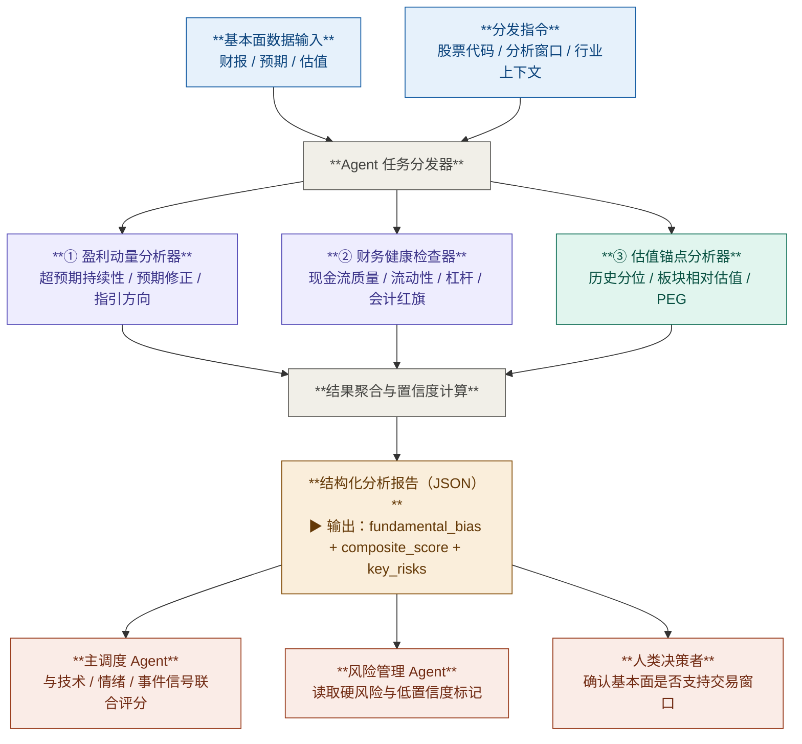

# 基本面分析模块

## 1. 模块目标

本模块服务于 **1 周到 3 个月** 的中期交易分析，目标不是判断企业的长期内在价值，而是回答两个更直接的问题：

1. 公司的盈利兑现能力是否在改善或恶化
2. 标的是否存在会在持仓窗口内放大风险的基本面脆弱点

模块输出必须是 **结构化、可追溯、可复现** 的信号，不直接输出买入 / 卖出指令。

---

## 2. 边界定义

### 范围内

- 盈利结果与预期修正的方向性判断
- 财务健康与近端脆弱点筛查
- 估值所处区间及压缩 / 扩张空间判断
- 结构化风险提取与模块级别 `fundamental_bias`

### 范围外

- 未来 0-90 天催化剂识别与事件强度判断
- 新闻、社媒、期权情绪、IV 百分位、分析师升级 / 降级解读
- 长周期 DCF、ROIC、行业深度研究
- 自动生成交易指令

说明：
- 催化剂识别应由 **事件分析模块** 负责
- 新闻与预期情绪应由 **情绪分析模块** 负责
- 基本面模块只负责提供可被上层调度器消费的结构化基本面信号

---

## 3. 输入

### 3.1 基础上下文

- `ticker`
- `analysis_window_days`：默认 `[7, 90]`
- `sector` / `industry`：用于相对估值

### 3.2 财务与盈利数据

- 最近 8 个季度实际 EPS、营收、毛利率、营业利润率
- 最近 4 个季度经营现金流、资本开支、自由现金流
- 最近 4 个季度现金及等价物、总债务、流动资产、流动负债、利息费用
- 最近 30 / 60 天分析师 EPS / 营收一致预期修正
- 最近 2 次管理层指引变化

### 3.3 估值数据

- 当前 TTM / NTM 估值倍数：`P/E`、`EV/EBITDA`、`P/S`、`P/FCF`
- 至少 3 年、优先 5 年的历史估值分布
- 同行业或同板块可比中位数
- `PEG` 或近似增长调整估值指标

### 3.4 数据来源要求

- 每个数据集必须记录：`source`、`fetched_at`、`staleness_days`、`missing_fields`
- 若发生人工覆盖或备用源回退，必须记录 `override_reason`
- 若关键字段缺失，不得用自然语言补全猜测，只能降级输出并标记低置信度

---

## 4. 处理流程



---

## 5. 子 Agent 规格说明

### ① 盈利动量分析器

**输入：** 最近 8 个季度实际结果、市场一致预期、30 / 60 天修正、管理层指引

**核心目标：** 判断盈利兑现趋势是改善、稳定还是走弱。

**计算指标：**

| 指标 | 规则 | 说明 |
|---|---|---|
| `eps_beat_streak_quarters` | 连续 EPS 超预期季度数 | 反映兑现稳定性 |
| `avg_eps_surprise_pct_4q` | 最近 4 季 EPS 平均超预期幅度 | 反映盈利强弱 |
| `avg_revenue_surprise_pct_4q` | 最近 4 季营收平均超预期幅度 | 反映需求与执行 |
| `eps_revision_balance_30d` | `(上调数 - 下调数) / max(总修正数, 1)` | 范围 `[-1, 1]` |
| `eps_revision_balance_60d` | 同上 | 用于趋势确认 |
| `revenue_revision_balance_30d` | 同上 | 防止只看 EPS |
| `guidance_trend` | `Raised / Maintained / Lowered / NoGuidance` | 管理层口径变化 |
| `current_quarter_bar` | `High / Normal / Low` | 由预期抬升速度决定 |

**标签规则：**

- `earnings_momentum = Accelerating`
  - `eps_revision_balance_30d >= 0.25`
  - 且 `avg_eps_surprise_pct_4q > 0`
  - 且 `guidance_trend != Lowered`
- `earnings_momentum = Decelerating`
  - `eps_revision_balance_30d <= -0.25`
  - 或 `guidance_trend = Lowered`
- 其他情况为 `Stable`

**评分规则：**

```text
earnings_score =
  beat_quality_score      (0-30) +
  revision_signal_score   (0-35) +
  revenue_confirmation    (0-15) +
  guidance_score          (0-20)
```

**输出字段：**

- `eps_beat_streak_quarters`：`number`
- `avg_eps_surprise_pct_4q`：`number`
- `avg_revenue_surprise_pct_4q`：`number`
- `eps_revision_balance_30d`：`number`
- `eps_revision_balance_60d`：`number`
- `revenue_revision_balance_30d`：`number`
- `current_quarter_bar`：`High | Normal | Low`
- `guidance_trend`：`Raised | Maintained | Lowered | NoGuidance`
- `earnings_momentum`：`Accelerating | Stable | Decelerating`
- `earnings_score`：`0-100`

---

### ② 财务健康检查器

**输入：** 最近 4 个季度资产负债表、利润表、现金流量表

**核心目标：** 识别会在持仓窗口内显著放大回撤风险的脆弱点。

**检查项目：**

| 项目 | 核心指标 | 红旗含义 |
|---|---|---|
| 现金流质量 | `FCF / Net Income`、`CFO / Net Income` | 利润无法转化为现金 |
| 流动性压力 | 流动比率、现金 / 短债、近期债务到期 | 持仓窗口内可能存在融资压力 |
| 盈利质量 | 应收 / 库存增速 vs 营收增速 | 收入确认或需求质量恶化 |
| 杠杆压力 | 净债务 / EBITDA、利息覆盖 | 负面事件放大器 |

**硬风险规则：**

只有满足明确、客观的近端风险条件时，才允许触发 `disqualify = true`：

1. `cash_to_short_term_debt < 1`
2. 且 `interest_coverage < 1.5` 或连续 2 个季度自由现金流为负
3. 且 `data_staleness_days <= 120`

说明：
- `High` 风险不等于自动取消资格
- 只有命中硬风险规则，才触发一票否决

**评级规则：**

- `overall_rating = High`
  - 命中硬风险规则
  - 或 4 个检查项中至少 2 项为红旗
- `overall_rating = Medium`
  - 恰好 1 项为红旗
- `overall_rating = Low`
  - 无明确红旗

**评分规则：**

```text
health_score =
  cashflow_quality_score  (0-30) +
  liquidity_score         (0-25) +
  earnings_quality_score  (0-20) +
  leverage_score          (0-25)
```

**输出字段：**

- `overall_rating`：`Low | Medium | High`
- `disqualify`：`boolean`
- `hard_risk_reasons`：`string[]`
- `checks`：`HealthCheckItem[]`
- `health_score`：`0-100`
- `data_staleness_days`：`number`

---

### ③ 估值锚点分析器

**输入：** 当前估值倍数、历史估值分布、同板块中位数、PEG

**核心目标：** 判断估值是顺风、逆风，还是中性背景。

**主指标选择顺序：**

1. 盈利稳定为正：优先 `Forward P/E`
2. 资本密集行业：优先 `EV/EBITDA`
3. 未盈利公司：优先 `P/S`
4. 成熟现金流公司：补充 `P/FCF`

**计算指标：**

| 指标 | 规则 | 说明 |
|---|---|---|
| `primary_metric_used` | 按适用对象选择 | 避免多指标混用失真 |
| `historical_percentile` | 当前倍数在历史分布中的百分位 | 判断历史贵/便宜 |
| `peer_relative_ratio` | 当前倍数 / 板块中位数 | 判断相对估值 |
| `peg_ratio` | 当前估值 / 增长率 | 识别透支程度 |

**空间评级规则：**

- `Undervalued`
  - `historical_percentile <= 30`
  - 且 `peer_relative_ratio <= 0.9`
- `Fair`
  - `30 < historical_percentile < 70`
- `Elevated`
  - `70 <= historical_percentile < 85`
  - 或 `peer_relative_ratio > 1.1`
- `Compressed`
  - `historical_percentile >= 85`
  - 且 `peer_relative_ratio > 1.2`

**评分规则：**

```text
valuation_score =
  historical_percentile_score  (0-50) +
  peer_relative_score          (0-30) +
  peg_adjustment               (-10 to +20)
```

**输出字段：**

- `primary_metric_used`：`ForwardPE | EVEBITDA | PriceToSales | PriceToFCF`
- `space_rating`：`Undervalued | Fair | Elevated | Compressed`
- `historical_percentile`：`number`
- `peer_relative_ratio`：`number`
- `peg_ratio`：`number | null`
- `peg_flag`：`Valid | NotApplicablePrimaryMetric | MissingGrowth | GrowthTooLow | NegativeGrowth | NegativeOrZeroMultiple`
- `metrics`：`ValuationMetric[]`
- `valuation_score`：`0-100`

---

## 6. 聚合与信号综合

聚合器收集三个子 Agent 输出后，先检查硬风险否决门，再按固定权重计算 `composite_score`。

这样设计有两个目的：

1. 保持模块本身稳定，不把上层事件权重逻辑混进基本面模块
2. 避免同一催化剂或情绪信息在多个模块中重复计分

### 6.1 固定权重

- `earnings`：`0.45`
- `health`：`0.35`
- `valuation`：`0.20`

### 6.2 缺失数据归一化

若某子模块关键输入缺失，允许该子模块降级输出，但聚合器必须做权重归一化：

```text
composite_score =
  sum(available_module_score × available_module_weight)
  / sum(available_module_weight)
```

若可用权重之和 `< 0.70`，则：

- `fundamental_bias` 最多只能输出 `Neutral`
- 并将对应模块写入 `low_confidence_modules`

### 6.3 否决门

- 若 `health.disqualify = true`
  - `composite_score = 0`
  - `fundamental_bias = Disqualified`

### 6.4 方向结论

- `composite_score >= 70` → `fundamental_bias = Bullish`
- `45 <= composite_score < 70` → `fundamental_bias = Neutral`
- `composite_score < 45` → `fundamental_bias = Bearish`

### 6.5 关键风险提取

- `guidance_trend = Lowered` → 标记盈利动量转弱
- `current_quarter_bar = High` 且 `earnings_momentum != Accelerating` → 标记高预期兑现风险
- `overall_rating = High` → 标记财务脆弱性
- `space_rating = Compressed` → 标记估值压缩风险
- 关键输入缺失或过期 → 标记低置信度风险

---

## 7. 输出 Schema

API 对齐说明：

- 本节定义的是**基本面模块内部聚合输出**
- 该模块在公共 HTTP 响应中映射到 `fundamental_analysis`
- 对外字段与机器可读契约以 [../api/schemas.md](../api/schemas.md) 和 [../api/openapi.yaml](../api/openapi.yaml) 为准

```json
{
  "schema_version": "1.1",
  "ticker": "string",
  "analysis_timestamp": "ISO 8601",
  "target_horizon_days": [14, 60],
  "module_scope": "LightweightFundamentalV1",
  "earnings": {
    "eps_beat_streak_quarters": "number",
    "avg_eps_surprise_pct_4q": "number",
    "avg_revenue_surprise_pct_4q": "number",
    "eps_revision_balance_30d": "number",
    "eps_revision_balance_60d": "number",
    "revenue_revision_balance_30d": "number",
    "current_quarter_bar": "High | Normal | Low",
    "guidance_trend": "Raised | Maintained | Lowered | NoGuidance",
    "earnings_momentum": "Accelerating | Stable | Decelerating",
    "earnings_score": "number"
  },
  "health": {
    "overall_rating": "Low | Medium | High",
    "disqualify": "boolean",
    "hard_risk_reasons": ["string"],
    "category_ratings": {
      "cashflow_quality": "Low | Medium | High",
      "liquidity_pressure": "Low | Medium | High",
      "earnings_quality": "Low | Medium | High",
      "leverage_pressure": "Low | Medium | High"
    },
    "red_flag_categories": ["string"],
    "checks": ["HealthCheckItem"],
    "health_score": "number",
    "data_staleness_days": "number",
    "missing_fields": ["string"]
  },
  "valuation": {
    "primary_metric_used": "ForwardPE | EVEBITDA | PriceToSales | PriceToFCF",
    "space_rating": "Undervalued | Fair | Elevated | Compressed",
    "historical_percentile": "number",
    "peer_relative_ratio": "number",
    "peg_ratio": "number | null",
    "peg_flag": "Valid | NotApplicablePrimaryMetric | MissingGrowth | GrowthTooLow | NegativeGrowth | NegativeOrZeroMultiple",
    "metrics": ["ValuationMetric"],
    "valuation_score": "number",
    "staleness_days": "number",
    "missing_fields": ["string"]
  },
  "weight_scheme_used": {
    "configured_weights": {
      "earnings": "number",
      "health": "number",
      "valuation": "number"
    },
    "available_weight_sum": "number",
    "applied_weights": {
      "earnings": "number",
      "health": "number",
      "valuation": "number"
    },
    "renormalized": "boolean"
  },
  "composite_score": "number",
  "fundamental_bias": "Bullish | Neutral | Bearish | Disqualified",
  "key_risks": [
    {
      "risk_key": "string",
      "risk_label": "string",
      "source_module": "earnings | health | valuation",
      "rule_id": "string",
      "priority": "number"
    }
  ],
  "data_completeness_pct": "number",
  "low_confidence_modules": [
    {
      "module": "earnings | health | valuation",
      "status": "degraded | excluded",
      "reason_codes": ["string"],
      "excluded_from_score": "boolean"
    }
  ],
  "source_trace": ["SourceTraceItem"],
  "llm_summary": "string | null"
}
```

---

## 8. 实现约束

### 8.1 确定性优先

- 所有标签必须来自明确阈值，不允许自由发挥解释
- 同一输入在同一版本规则下必须产生同一输出

### 8.2 可追溯性优先

- 每个结论必须能回溯到原始字段和评分项
- `llm_summary` 只能总结结构化结果，不得覆盖结构化字段

### 8.3 简化优先

- v1 不接入事件强度、IV 百分位、13F、内部人交易、分析师动作
- 若后续确有价值，应作为独立扩展字段接入，不能直接重写 v1 分数含义

---

## 9. 范围约束

| 范围内 | 范围外 |
|---|---|
| 1 周到 3 个月持仓周期内的盈利与财务方向性判断 | 长周期内在价值建模 |
| 财务脆弱点与近端硬风险筛查 | 催化剂识别与事件概率判断 |
| 相对估值与估值压缩风险 | 新闻 / 社媒 / 期权情绪分析 |
| 模块级结构化基本面偏向输出 | 自动生成买卖指令 |
