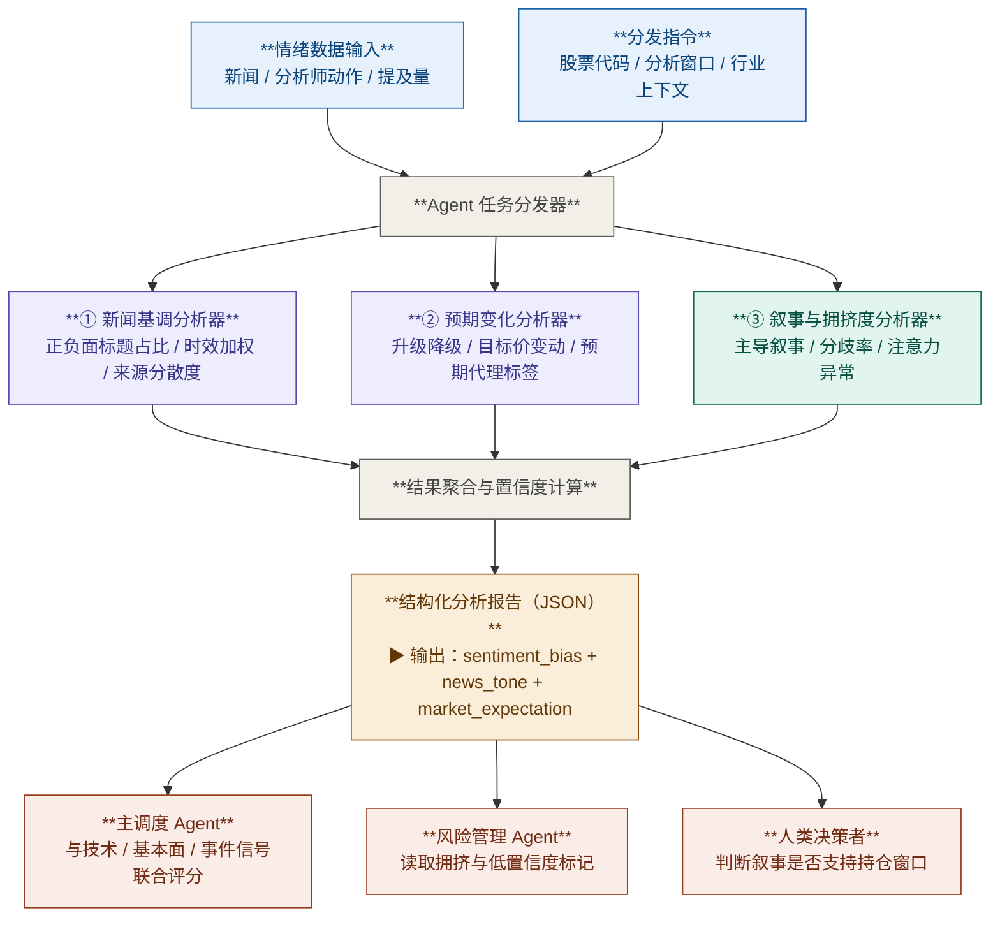

# 情绪分析模块

## 1. 模块目标

本模块服务于 **1 周到 3 个月** 的中期交易分析，目标不是预测新闻事件本身会不会发生，而是回答两个更直接的问题：

1. 近期公开信息的整体基调偏多、偏空还是中性
2. 市场对该标的的短期预期是在改善、恶化，还是处于分歧状态

模块输出必须是 **结构化、可追溯、可复现** 的信号，不直接输出买入 / 卖出指令。

---

## 2. 边界定义

### 范围内

- 新闻标题与新闻摘要的情绪基调判断
- 卖方分析师动作与公开预期变化的方向性判断
- 市场叙事是否集中、分裂或过度拥挤的结构化提取
- 模块级别 `sentiment_bias`、`news_tone` 与 `market_expectation`

### 范围外

- 财报日、FOMC、CPI、FDA 审批等事件时间表识别
- EPS / 营收一致预期的数值建模与财务兑现验证
- 价格趋势、成交量、突破 / 破位等技术信号
- 自动生成交易指令

说明：

- 事件时间与催化剂强度应由 **事件分析模块** 负责
- 分析师一致预期修正的数值判断应由 **基本面模块** 负责
- 价格行为与波动结构应由 **技术分析模块** 负责
- 情绪模块只负责提供可被上层调度器消费的结构化预期与叙事信号

---

## 3. 输入域

### 3.1 基础上下文

- `ticker`
- `analysis_window_days`：默认 `[7, 90]`
- `sector` / `industry`
- `primary_market`

### 3.2 新闻与舆情数据

- 最近 7 / 30 天与标的直接相关的新闻标题
- 可选的新闻摘要或首段摘要
- 每条记录至少包含：
  - `headline`
  - `published_at`
  - `source_name`
  - `source_type`：`news | wire | analyst | social`
  - `url`
  - `language`
  - `relevance_score`

### 3.3 分析师动作与预期代理信号

- 最近 30 / 60 天公开可见的分析师动作
- 最近 14 天与预期变化直接相关的结构化新闻标签

### 3.4 注意力与拥挤度数据

- 最近 1 / 7 / 30 天提及量
- 最近 90 天基线提及量
- 最近 7 天独立来源数
- 可选的社媒提及量与互动量

### 3.5 数据来源要求

- 每个数据集必须记录：`source`、`fetched_at`、`staleness_days`、`missing_fields`
- 每条标题级记录必须保留 `url` 或唯一来源标识，禁止只保留总结文本
- 若使用 LLM 进行标题标签抽取，必须记录 `classifier_version`
- 若关键来源缺失，不得用自然语言推测市场情绪，只能降级输出并标记低置信度

---

## 4. 处理流程



---

## 5. 文档结构

本目录采用 **1 份总览 + 4 份子文档** 的组织方式。总览只定义模块边界、流程和统一接口；阈值、评分、降级规则与 JSON 示例全部下沉到子文档。

### 5.1 子模块文档

- [news_tone.md](/Users/leo/Dev/TradePilot/docs/zh/design/sentimental_analysis_agent/news_tone.md:1)
  定义新闻标题去重、相关性过滤、事件类型映射、时效加权、`news_tone` 与 `news_score`。
- [expectation_shift.md](/Users/leo/Dev/TradePilot/docs/zh/design/sentimental_analysis_agent/expectation_shift.md:1)
  定义分析师动作标准化、目标价修正口径、预期代理标签、`expectation_shift` 与 `expectation_score`。
- [narrative_crowding.md](/Users/leo/Dev/TradePilot/docs/zh/design/sentimental_analysis_agent/narrative_crowding.md:1)
  定义主题提取、主导叙事、`contradiction_ratio`、`attention_zscore_7d`、`crowding_flag` 与 `narrative_score`。
- [signal_aggregation.md](/Users/leo/Dev/TradePilot/docs/zh/design/sentimental_analysis_agent/signal_aggregation.md:1)
  定义三个子模块到方向子信号的映射、权重、归一化、`sentiment_bias`、`market_expectation`、`key_risks` 与降级策略。

### 5.2 阅读顺序

1. 先读本总览，确认边界和整体流程
2. 再读三个子模块文档，确认各自输入、规则和输出
3. 最后读聚合文档，确认模块级结论如何生成

---

## 6. 模块间契约

### 6.1 子模块输出职责

- 新闻基调分析器负责输出：
  - `news_tone`
  - `recency_weighted_tone`
  - `news_score`
- 预期变化分析器负责输出：
  - `expectation_shift`
  - `target_revision_median_pct_30d`
  - `expectation_score`
- 叙事与拥挤度分析器负责输出：
  - `narrative_state`
  - `contradiction_ratio`
  - `attention_zscore_7d`
  - `crowding_flag`
  - `narrative_score`

### 6.2 聚合层职责

聚合层是模块内唯一允许做跨子模块权重组合的地方，负责：

- 将三个子模块映射为方向子信号
- 处理缺失数据、低覆盖和过期数据
- 计算 `composite_score`
- 生成 `sentiment_bias`
- 生成 `market_expectation`
- 提取 `key_risks`

子模块之间不允许直接消费彼此结论。

---

## 7. 统一输出口径

API 对齐说明：

- 本节定义的是**情绪模块内部聚合输出**
- 该模块在公共 HTTP 响应中映射到 `sentiment_expectations`
- 对外字段与 API 映射以 [../implementation/01_runtime/response-assembly-and-api-mapping.md](../implementation/01_runtime/response-assembly-and-api-mapping.md) 为准

情绪模块对上层主调度器暴露的核心字段保持固定：

```json
{
  "news_tone": "positive | neutral | negative",
  "market_expectation": "string",
  "sentiment_summary": "string | null",
  "composite_score": "number",
  "sentiment_bias": "Bullish | Neutral | Bearish",
  "key_risks": ["string"],
  "data_completeness_pct": "number",
  "low_confidence_modules": ["string"]
}
```

补充说明：

- `composite_score` 为对外模块级统一分数
- 聚合实现内部允许同时保留 `normalized_composite_score` 作为实现口径，但对外语义必须与 `composite_score` 一致
- 详细字段、证据列表和风险结构见 [signal_aggregation.md](/Users/leo/Dev/TradePilot/docs/zh/design/sentimental_analysis_agent/signal_aggregation.md:1)

---

## 8. 关键设计原则

### 8.1 模块独立

- 新闻、预期、叙事三个子模块都只消费原始数据或标准化后的公共上下文
- 不允许一个子模块读取另一个子模块的结论作为输入

### 8.2 上层统一聚合

- 所有跨子模块评分必须在聚合层完成
- 单个子模块内部只输出本子模块自己的结构化信号

### 8.3 可追溯性

- 每个子模块输出必须带来源、时间戳、缺失字段和低置信度标记
- 最终结论必须能回溯到中间模块结果

### 8.4 确定性优先

- 标签、阈值、评分和模板文本必须来自固定规则
- 同一输入在同一版本规则下必须产生同一输出

---

## 9. 范围约束

| 范围内 | 范围外 |
|---|---|
| 最近 7-30 天新闻与公开预期变化 | 实时分钟级情绪监控 |
| 新闻基调、分析师动作、叙事集中度 | 事件时间表与催化剂强度预测 |
| 情绪拥挤与注意力异常检测 | 财务报表建模与一致预期数值分析 |
| 模块级结构化情绪偏向输出 | 自动生成买卖指令 |
