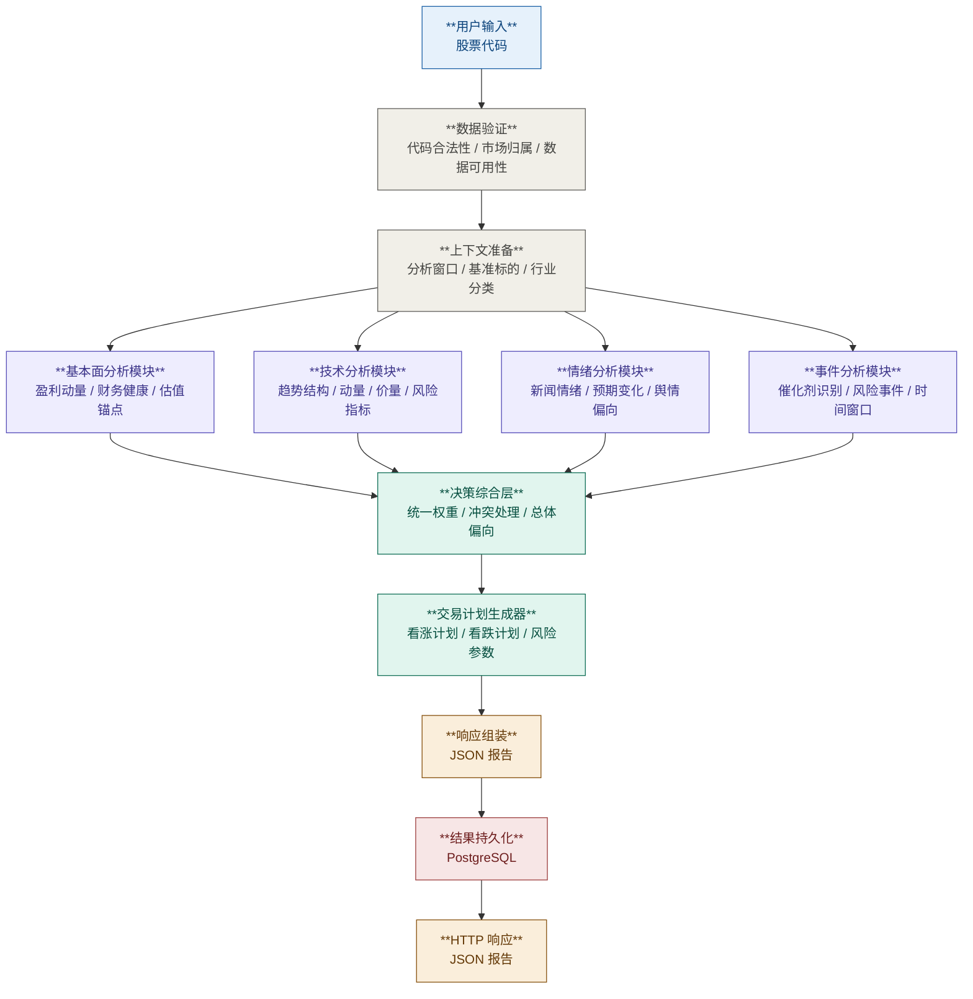

# 系统架构

## 1. 主请求处理流程

系统接收用户输入的股票代码后，先完成数据验证与基础上下文准备，再并行触发四个核心分析模块：

- 基本面分析
- 技术分析
- 情绪分析
- 事件分析

四个模块各自产出结构化中间结果，由主调度层统一聚合，先生成系统级决策结论，再生成交易计划候选。

---

## 2. 流程图

---

## 3. 架构层与技术实现映射

V1 不是开放选型，而是固定使用以下映射关系：

- 输入/API 层：`FastAPI + Pydantic v2`
  - 负责请求接入、参数校验、错误响应和顶层响应序列化
- 流程编排层：`LangGraph`
  - 负责主请求图的节点编排、并行分析分支和聚合顺序控制
- Provider 接入层：`httpx`
  - 负责访问外部 REST 数据源，并承载超时、重试和连接管理
- 结果持久化层：`PostgreSQL`
  - 负责保存分析结果、交易计划和最终响应快照，支持历史查询与复盘
- 分析与规则层：`Python 3.11`
  - 负责技术、基本面、情绪、事件、决策综合和交易计划生成的确定性逻辑
- 测试层：`pytest`
  - 负责验证 API 契约、graph 流程和规则边界
- 工程环境与命令层：`uv`
  - 负责依赖安装、虚拟环境管理和统一的本地开发命令入口

这样拆分的原因：

- 把 HTTP 协议处理、流程编排、外部取数和分析规则明确分层
- 把最终结果持久化与实时分析执行明确分层
- 避免在 API 层混入业务逻辑，或在 provider 层直接做决策
- 让系统架构图能够直接映射到实现代码结构和测试边界
- 避免在工程层同时维护多套 Python 环境与命令管理方式

详细实现约束见 [../implementation/implementation-stack.md](../implementation/implementation-stack.md)。

---

## 4. 分层说明

### 4.1 输入与验证层

负责：

- 校验股票代码是否合法
- 判断是否属于支持范围内的市场与标的
- 检查关键数据源是否可用
- 准备统一分析窗口与行业上下文

这一层不做方向判断，只负责确保下游模块使用一致输入。

### 4.2 并行分析层

四个分析模块必须并行运行，而不是串行依赖：

1. **基本面分析模块**
   - 输出盈利、财务健康、估值相关的结构化信号
   - 不负责事件催化剂和情绪解读

2. **技术分析模块**
   - 输出趋势、动量、价量关系、形态与风险参数

3. **情绪分析模块**
   - 输出新闻、舆情、预期变化等偏向性信号

4. **事件分析模块**
   - 输出未来 0-90 天内与持仓窗口直接相关的催化剂、风险事件和事件偏向
   - 负责识别财报日期、宏观高敏感日程和公司特定二元事件
   - 不负责价格行为解读、财务建模或新闻情绪打分

这样设计的原因：

- 避免模块之间隐式依赖
- 降低整体延迟
- 便于缓存和独立演进
- 防止同类信息在多个模块重复计分
- 把“方向判断”和“执行时点风险”显式拆开，避免把近端事件错误混入基本面或情绪

### 4.3 事件分析模块职责

事件分析模块的核心任务不是预测事件结果，而是识别**哪些事件会在当前持仓窗口内显著改变交易的胜率或执行性**。

范围内：

- 财报日期与财报前后窗口识别
- 宏观敏感事件识别，如 FOMC、CPI、非农等
- 公司特定催化剂与风险事件提取，如 FDA 审批、监管裁决、产品发布、重大诉讼或并购进展
- 结构化输出 `upcoming_catalysts`、`risk_events`、`event_bias`

范围外：

- 重新计算价格趋势、支撑阻力或成交量信号
- 重新建模 EPS / 营收兑现质量
- 用新闻情绪替代事件时点判断
- 直接生成买卖指令

该模块的价值主要体现在两个方面：

- 为决策综合层提供独立的事件方向与近端风险约束
- 为交易计划生成器提供明确的 `do_not_trade_conditions` 触发背景

补充口径：

- 事件分析模块与技术、基本面、情绪模块一样，属于默认启用的核心并行模块
- 事件窗口默认覆盖未来 `0-90` 天，以完整覆盖系统定义的 `1 周 - 3 个月` 持仓周期

### 4.4 决策综合层

负责：

- 接收四个模块的结构化输出
- 对缺失数据和低置信度结果进行降权
- 处理模块之间的信号冲突
- 生成总体市场偏向：`Bullish / Neutral / Bearish`

补充约束：

- 事件模块既可以贡献方向信号，也可以仅提供执行层面的风险否决
- 近端重大事件风险应优先影响 `actionability`，而不是机械改写长期方向判断

这一层是唯一允许做跨模块权重组合的地方。

### 4.5 交易计划生成层

负责：

- 基于综合结论生成候选交易计划
- 同时产出看涨和看跌场景
- 输出入场条件、止损逻辑、止盈逻辑与风险收益参数

约束：

- 不重新计算总体方向，只消费决策综合层的 `overall_bias`、`actionability_state`、`blocking_flags` 等系统级字段
- 若主调度器额外提供技术或事件上下文，这些字段只能用于填充价格锚点和解释文案，不得参与分支判断
- 当事件风险、低置信度或硬风险出现时，必须优先服从系统级约束，压制为保守计划或回避条件
- 若事件模块返回近端重大催化剂或二元风险，应显式写入交易计划的等待条件或不交易条件

详细设计见 [trade_plan_generator/overview.md](/Users/leo/Dev/TradePilot/docs/zh/design/trade_plan_generator/overview.md:1)。

对外 API 对齐：

- 主入口接口见 [../api/analyses.md](../api/analyses.md)
- 顶层响应字段见 [../api/schemas.md](../api/schemas.md)
- 机器可读契约见 [../api/openapi.yaml](../api/openapi.yaml)
- LangGraph 与运行时实现见 [../implementation/langgraph-graph.md](../implementation/langgraph-graph.md) 和 [../implementation/runtime-contract.md](../implementation/runtime-contract.md)

### 4.6 结果持久化层

负责：

- 将单次分析的请求信息、模块结果、决策综合结果、交易计划和顶层响应快照写入 `PostgreSQL`
- 为历史查询、对比分析和后续评估提供稳定存储

约束：

- 持久化的是最终分析产物，不是 LangGraph 的 checkpoint 或线程恢复状态
- 持久化写入是主请求链路的一部分，不能异步丢给后台任务默默失败
- 存储层只负责保存和读取结构化结果，不重新计算任何分析结论
- 具体 PostgreSQL 表结构见 [../implementation/postgresql-schema.md](../implementation/postgresql-schema.md)

---

## 5. 关键架构原则

### 5.1 模块独立

- 基本面、技术、情绪、事件模块各自消费原始数据或标准化后的公共上下文
- 不允许一个分析模块依赖另一个分析模块的结论作为输入

### 5.2 上层统一聚合

- 所有跨模块评分必须在决策综合层完成
- 单模块内部只输出本模块自己的结构化信号

### 5.3 可追溯性

- 每个模块输出必须带有来源、时间戳、缺失字段和低置信度标记
- 最终结论必须能追溯到中间模块结果

### 5.4 可扩展性

- 事件分析模块应作为并行模块接入决策综合层，而不是拆散到基本面或情绪模块中
- 后续若扩展更多事件类型，应优先扩展事件模块内部能力，而不是修改其他模块边界
