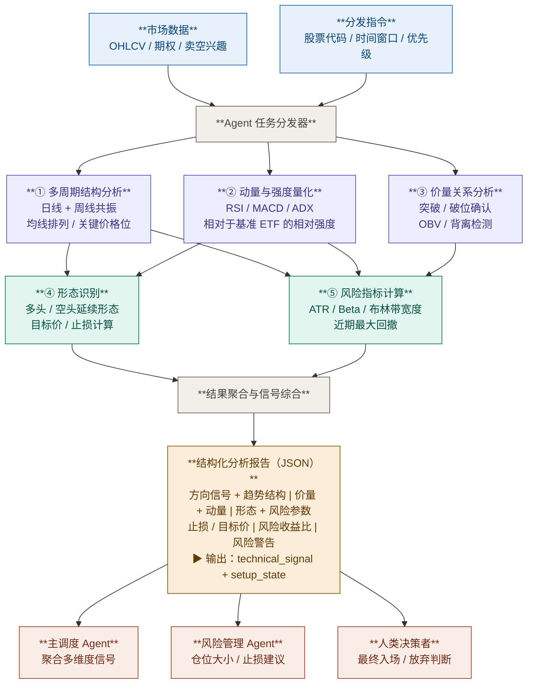

# 技术分析模块

## 1. 输入

### 1a. OHLCV K线数据
- **粒度：** 日线和周线
- **回溯期：** 最少 1 年（日线 ≥252 个交易日；周线 ≥52 周）
- **字段：** 开盘价、最高价、最低价、收盘价、成交量

### 1b. 衍生市场数据
| 字段 | 说明 |
|---|---|
| 认沽/认购比率 | 期权情绪指标；>1 看跌，<0.7 看涨 |
| 隐含波动率（IV） | 当前 IV vs. 30 日历史 IV；IV 偏高 = 需谨慎 |
| 未平仓量 | 关键行权价的集中度揭示支撑/阻力 |
| 卖空兴趣 | 做空股数占流通股的比例 |
| 卖空兴趣比率 | 回补天数 = 卖空兴趣 / 日均成交量 |

### 1c. 市场环境数据
- **基准：** SPY（标普500）、QQQ（纳斯达克100）或板块 ETF
- **用途：** 相对强度计算；个股信号的宏观背景

### 数据来源
- **主要：** `yfinance` — 用作原型期 / 低成本基线的数据源（OHLCV、期权链、卖空兴趣）
- **要求：** 模块实现必须保留来源名称、抓取时间和缺失字段处理规则，避免“手工覆盖后不可追溯”
- **备用：** 可替换的数据提供方或手动覆盖，但必须记录覆盖原因、时间戳和覆盖字段

---

## 2. 处理流程



---

## 3. 子 Agent 规格说明

### ① 多周期结构分析

**输入：** 日线 OHLCV、周线 OHLCV

**计算指标：**
| 指标 | 参数 | 解读 |
|---|---|---|
| SMA | 20、50、200（日线） | 价格在三条线上方 = 多头排列 |
| EMA | 10、21（日线） | 短期动量方向 |
| 周线 SMA | 10、40 | 中期趋势确认 |
| 支撑 / 阻力 | 波段高低点（回溯 52 周） | 入场和止损的关键价格位 |

**共振规则：** 只有日线和周线趋势方向一致时，方向信号才被视为高可信度；若二者冲突，默认降为 `neutral` 或仅保留 `watch` 状态，除非出现明确的突破 / 破位确认。

**输出字段：**
- `trend_daily`：`bullish | bearish | neutral`
- `trend_weekly`：`bullish | bearish | neutral`
- `ma_alignment`：`fully_bullish | partially_bullish | mixed | fully_bearish`
- `key_support`：`[float]`
- `key_resistance`：`[float]`

---

### ② 动量与强度量化

**输入：** 日线 OHLCV、SPY / QQQ / 板块 ETF 日线 OHLCV

**计算指标：**
| 指标 | 参数 | 看涨阈值 | 看跌阈值 |
|---|---|---|---|
| RSI | 14 周期 | > 50（趋势中），> 60（强势） | < 50，< 40（弱势） |
| MACD | 12 / 26 / 9 | 上穿信号线，柱状图扩张 | 下穿信号线，柱状图收缩 |
| ADX | 14 周期 | > 25（趋势市场） | < 20（震荡，回避） |
| 相对强度 | 个股收益 / SPY 收益（63 日） | RS > 1.0 | RS < 0.8 |

**输出字段：**
- `rsi`：`float`
- `rsi_signal`：`overbought | healthy | oversold`
- `macd_signal`：`bullish_cross | bearish_cross | flat`
- `adx`：`float`
- `adx_trend_strength`：`strong | moderate | weak`
- `benchmark_used`：`SPY | QQQ | sector_etf`
- `relative_strength`：`float`
- `momentum_summary`：`string`

---

### ③ 价量关系分析

**输入：** 日线 OHLCV

**计算指标：**
| 指标 | 参数 | 解读 |
|---|---|---|
| OBV | 累积 | OBV 上升 = 积累；与价格背离 = 警告 |
| 成交量均线 | 20 日均量 | 突破时成交量 >1.5 倍均量 = 确认 |
| 突破 / 破位检测 | 收盘价 vs. 近 52 周高点 / 关键支撑 | 高量突破 = 看多确认；高量破位 = 看空确认 |
| 低量回调 / 弱反弹 | 回调日或反弹日成交量相对 20 日均量 | 低量回调偏健康；低量反弹偏弱势 |

**背离检测：**
- 看涨背离：价格创新低，OBV 创更高低点
- 看跌背离：价格创新高，OBV 创更低高点

**输出字段：**
- `obv_trend`：`rising | falling | flat`
- `obv_divergence`：`bullish | bearish | none`
- `breakout_confirmed`：`boolean`
- `breakdown_confirmed`：`boolean`
- `volume_pattern`：`accumulation | distribution | neutral | pullback_healthy | bounce_weak`

---

### ④ 形态识别

依赖 ①、②、③ 的输出。

**检测形态：**

| 形态 | 方向 | 持续周期 | 核心特征 | 目标价计算 | 止损位 |
|---|---|---|---|---|---|
| VCP（波动率收缩） | 多 | 10–40日 | 多次回调幅度依次收窄，成交量同步萎缩，浮筹逐步出清 | 旗杆高度的 50%–100% 从突破点向上投影 | 最后枢轴低点下方 1×ATR |
| 牛市旗形 | 多 | 5–15日 | 急涨旗杆后量缩平行回调，回调幅度不超过旗杆涨幅的 38.2% | 旗杆涨幅从突破点等幅向上投影 | 旗形最低点下方 1×ATR |
| Flat Base（平台整理突破） | 多 | 15–60日 | 强势上涨后横盘整理，整理期间价格振幅 ≤15%，成交量持续低迷 | 平台高度从突破点等幅向上投影 | 平台最低点下方 1×ATR |
| 上升三角形 | 多 | 15–60日 | 水平压力线 + 上升支撑线收敛，买方逐步抬高低点，蓄势突破 | 三角形最宽处高度从突破点等幅向上投影 | 最后支撑低点下方 1×ATR |
| 杯柄形态（压缩版） | 多 | 杯 30–50日 + 柄 5–15日 | 圆弧底洗盘后右侧柄部量缩小幅回调，柄深 ≤15% | 杯深从突破点等幅向上投影 | 柄部最低点下方 1×ATR |
| 熊市旗形 | 空 | 5–15日 | 急跌旗杆后量缩平行反弹，反弹幅度不超过旗杆跌幅的 38.2% | 旗杆跌幅从破位点等幅向下投影 | 旗形最高点上方 1×ATR |
| 平台/箱体破位 | 空 | 15–60日 | 多次测试同一支撑位后放量失守，买方承接力彻底衰竭 | 平台高度从破位点等幅向下投影 | 平台中间价上方 1×ATR |
| 下降三角形 | 空 | 15–60日 | 水平支撑线 + 下降压力线收敛，空方持续压低高点，蓄势破位 | 三角形最宽处高度从破位点等幅向下投影 | 最后阻力高点上方 1×ATR |

> 各形态的详细识别规则（前提条件、结构约束、触发条件、量能要求）见形态识别模块设计文档。

---

**输出字段：**
- `pattern_direction`：`bullish | bearish | none`
- `pattern_detected`：`vcp | bull_flag | flat_base | ascending_triangle | cup_and_handle | bear_flag | breakdown_base | descending_triangle | none`
- `pattern_quality`：`high | medium | low`
- `entry_trigger`：`string`（例如，`"高量收盘突破 $142.50 枢轴"`）
- `target_price`：`float`
- `stop_loss_price`：`float`
- `risk_reward_ratio`：`float`

---

### ⑤ 风险指标计算

依赖 ①、②、③ 的输出。

**计算指标：**
| 指标 | 参数 | 解读 |
|---|---|---|
| ATR | 14 周期 | 仓位大小单位；止损距离参考 |
| Beta | vs. SPY，252 日 | Beta > 1.5 = 市场波动放大 |
| 布林带宽度 | 20 周期，2σ | 带宽收窄 = 波动率压缩（突破或破位前兆） |
| 最大回撤 | 滚动 63 日 | 近期痛点；> 20% 则标记 |
| IV vs. HV | 当前 IV / 30 日历史波动率 | IV 溢价 > 1.5 倍 = 期权昂贵；二元风险偏高 |

**输出字段：**
- `atr_14`：`float`
- `atr_pct`：`float`（ATR 占价格的百分比）
- `beta`：`float`
- `bb_width`：`float`
- `bb_squeeze`：`boolean`
- `max_drawdown_63d`：`float`
- `iv_vs_hv`：`float`
- `risk_flags`：`[string]`（例如，`["elevated beta", "iv premium"]`）

---

## 4. 聚合与信号综合

聚合器收集五个子 Agent 的输出后，先生成方向性子信号，再计算模块级 `technical_signal`。`watch / actionable / avoid` 只描述可执行状态，不替代方向。

**子信号生成：**

1. **结构信号（①）**
   - `bullish`：日线与周线同向看多，且均线结构至少为 `partially_bullish`
   - `bearish`：日线与周线同向看空，且价格 / 均线结构明确走弱
   - `neutral`：多空周期冲突或仅单周期成立

2. **动量信号（②）**
   - `bullish`：RSI > 50、MACD 偏多、相对强度 > 1
   - `bearish`：RSI < 50、MACD 偏空、相对强度 < 1
   - `neutral`：其余情况
   - `ADX < 20` 只降低可信度，不单独决定方向

3. **价量信号（③）**
   - `bullish`：`breakout_confirmed = true`，或 `accumulation` + 看涨背离
   - `bearish`：`breakdown_confirmed = true`，或 `distribution` + 看跌背离
   - `neutral`：其余情况

4. **形态信号（④）**
   - `bullish`：高 / 中质量的 `bull_flag | cup_and_handle | vcp`
   - `bearish`：高 / 中质量的 `bear_flag | breakdown_base`
   - `neutral`：无有效形态或质量过低

**模块评分：**

```text
technical_score =
  structure_signal × 0.35 +
  momentum_signal  × 0.25 +
  volume_signal    × 0.20 +
  pattern_signal   × 0.20
```

其中 `bullish = +1`，`neutral = 0`，`bearish = -1`。

**方向结论：**
- `technical_score > 0.30` → `technical_signal = bullish`
- `technical_score < -0.30` → `technical_signal = bearish`
- 其余 → `technical_signal = neutral`

`trend` 字段默认继承结构分析的总体方向，用于描述趋势背景；`technical_signal` 是可供系统级加权器直接消费的模块级方向结论。

**setup 状态：**
- `actionable`：方向明确，且已出现突破 / 破位确认，或形态触发价非常接近且无重大风险标记
- `watch`：方向存在，但触发尚未完成，或风险处于可接受但需等待确认的区间
- `avoid`：方向冲突明显，或重大风险标记激活（如 `max_drawdown_63d > 20%`、`atr_pct` 过高、`iv_vs_hv > 1.5`）

---

## 5. 输出 Schema

API 对齐说明：

- 本节定义的是**技术模块内部聚合输出**
- 该模块在公共 HTTP 响应中映射到 `technical_analysis`
- 对外字段与机器可读契约以 [../api/schemas.md](../api/schemas.md) 和 [../api/openapi.yaml](../api/openapi.yaml) 为准

```json
{
  "technical_signal": "bullish | bearish | neutral",
  "trend": "bullish | bearish | neutral",
  "trend_daily": "bullish | bearish | neutral",
  "trend_weekly": "bullish | bearish | neutral",
  "ma_alignment": "fully_bullish | partially_bullish | mixed | fully_bearish",
  "key_support": [float],
  "key_resistance": [float],
  "volume_pattern": "accumulation | distribution | neutral | pullback_healthy | bounce_weak",
  "obv_divergence": "bullish | bearish | none",
  "breakout_confirmed": boolean,
  "breakdown_confirmed": boolean,
  "momentum": "string",
  "benchmark_used": "SPY | QQQ | sector_etf",
  "rsi": float,
  "rsi_signal": "overbought | healthy | oversold",
  "macd_signal": "bullish_cross | bearish_cross | flat",
  "adx": float,
  "relative_strength": float,
  "pattern_direction": "bullish | bearish | none",
  "pattern_detected": "vcp | bull_flag | flat_base | ascending_triangle | cup_and_handle | bear_flag | breakdown_base | descending_triangle | none",
  "pattern_quality": "high | medium | low",
  "entry_trigger": "string",
  "target_price": float,
  "stop_loss_price": float,
  "risk_reward_ratio": float,
  "atr_14": float,
  "atr_pct": float,
  "beta": float,
  "bb_width": float,
  "bb_squeeze": boolean,
  "max_drawdown_63d": float,
  "iv_vs_hv": float,
  "risk_flags": ["string"],
  "setup_state": "actionable | watch | avoid",
  "technical_summary": "string"
}
```
---

## 6. 范围约束

| 范围内 | 范围外 |
|---|---|
| 日线和周线信号 | 日内/tick 级别分析 |
| 趋势跟踪、突破与破位形态 | 均值回归策略 |
| 成交量确认的行情 | 低流通量或场外交易股票 |
| 中期持仓（1 周 – 3 个月） | 长期投资（> 6 个月） |
| 相对于指数 ETF 的相对强度 | 板块轮动因子模型 |
| 期权衍生风险信号（IV、未平仓量） | 期权策略构建 |
