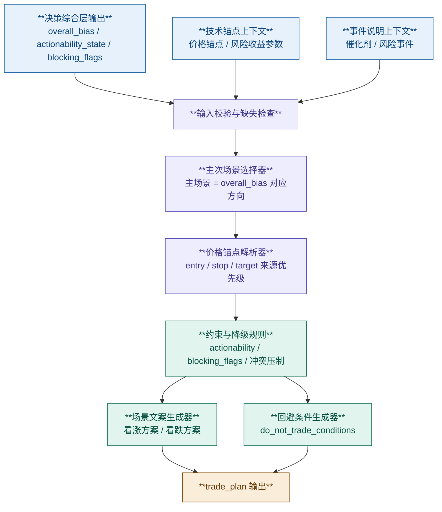

# 交易计划生成器

## 1. 模块目标

本模块位于**决策综合层之后、结构化输出之前**，目标不是重新判断方向，而是把上游已经完成的结构化结论转换为**可执行、双向、可追溯**的交易计划。

它需要回答三个问题：

1. 当前总体偏向下，哪个方向是主场景，哪个方向是备选场景
2. 每个方向在什么条件下允许入场，止损放在哪里，止盈看向哪里
3. 在什么情况下应当明确放弃交易，而不是为了满足输出格式强行给计划

模块输出必须是**确定性、规则驱动、可复现**的，不直接下达自动交易指令。

---

## 2. 边界定义

### 范围内

- 消费上游模块的结构化结论并生成 `trade_plan`
- 始终输出看涨和看跌两个场景
- 为每个场景生成入场条件、止损逻辑、止盈逻辑
- 生成 `do_not_trade_conditions`
- 将上游风险、低置信度和事件风险转写为交易约束

### 范围外

- 重新计算总体 `overall_bias`
- 重新打分技术、基本面、情绪模块
- 生成仓位大小、杠杆倍数或自动下单指令
- 虚构不存在的支撑位、阻力位、事件或价格锚点

说明：

- 总体方向、执行性和系统级风险约束由**决策综合层**负责
- 价格锚点与风险收益参数优先来自**技术分析模块**，但只能作为计划参数填充，不得参与方向或执行性分支
- 催化剂与风险事件优先来自**事件分析模块**；交易计划生成器只能消费主调度器注入的只读事件上下文，不能补写推测性事件

---

## 3. 输入契约

交易计划生成器只读取上游结构化输出，不直接访问原始行情、新闻或财务数据。

### 3.1 决策综合层输入（唯一分支依据）

| 字段 | 类型 | 是否必需 | 用途 |
|---|---|---|---|
| `overall_bias` | `bullish \| neutral \| bearish` | 是 | 确定主场景方向 |
| `confidence_score` | `0-1 float` | 是 | 调节计划保守度与 `do_not_trade_conditions` |
| `actionability_state` | `actionable \| watch \| avoid` | 是 | 决定是否允许输出可执行计划 |
| `conflict_state` | `aligned \| mixed \| conflicted` | 是 | 决定是否压制为观察方案 |
| `data_completeness_pct` | `0-100 float` | 是 | 识别信息完整度不足场景 |
| `blocking_flags` | `string[]` | 是 | 系统级硬约束与执行否决 |
| `risks` | `string[]` | 是 | 汇总系统级风险说明 |

### 3.2 技术锚点上下文（可选，非分支输入）

| 字段 | 类型 | 是否必需 | 用途 |
|---|---|---|---|
| `key_support` | `[float]` | 否 | 多头入场 / 空头止盈锚点 |
| `key_resistance` | `[float]` | 否 | 空头入场 / 多头止盈锚点 |
| `entry_trigger` | `string` | 否 | 优先复用技术模块的触发语句 |
| `target_price` | `float` | 否 | 优先作为止盈锚点 |
| `stop_loss_price` | `float` | 否 | 优先作为止损锚点 |
| `risk_reward_ratio` | `float` | 否 | 判断场景是否具备执行价值 |
| `atr_14` | `float` | 否 | 支撑/阻力缺口不足时的保护带 |
| `volume_pattern` | `string` | 否 | 入场确认描述 |
| `trend` | `bullish \| bearish \| neutral` | 否 | 背景描述 |

补充约束：

- 本组字段只能用于填充入场、止损、止盈锚点和解释文案
- 不得用这些字段覆盖 `overall_bias`、`actionability_state`、`blocking_flags` 或 `conflict_state`

### 3.3 事件说明上下文（可选，非分支输入）

| 字段 | 类型 | 是否必需 | 用途 |
|---|---|---|---|
| `upcoming_catalysts` | `string[]` | 否 | 计划说明中的触发背景 |
| `risk_events` | `string[]` | 否 | 生成事件型 `do_not_trade_conditions` |
| `event_summary` | `string` | 否 | 人类可读说明 |

### 3.4 最低可用输入

若以下条件同时满足，才允许生成**正常模式**的交易计划：

- 存在系统级 `overall_bias`
- 存在系统级 `actionability_state`
- 存在系统级 `confidence_score`

若同时满足以下条件，才允许生成**带具体锚点的计划**：

- 已满足正常模式输入
- 至少存在一组技术锚点字段（如 `entry_trigger`、`key_support`、`key_resistance`、`target_price`、`stop_loss_price`）

若缺失核心系统级字段，模块进入**降级模式**，只能输出保守计划与明确的 `do_not_trade_conditions`。

---

## 4. 处理流程



---

## 5. 核心生成规则

### 5.1 总体原则

- **不重算方向**：`overall_bias`、`actionability_state`、`blocking_flags` 直接由决策综合层提供，交易计划生成器只负责落地为场景
- **双向必出**：无论 `overall_bias` 为何，都必须同时输出 `bullish_scenario` 与 `bearish_scenario`
- **主次有别**：与 `overall_bias` 同方向的场景为主场景，可更积极；反方向场景为备选场景，默认使用更严格触发条件
- **无锚点不编造**：若缺少有效价格锚点，只能输出等待条件或不交易条件，不能凭语言猜测价格
- **上下文只补参数，不改结论**：技术和事件上下文只能填充价格锚点、触发条件和说明，不得改写系统级判断

### 5.2 主场景选择

| `overall_bias` | 主场景 | 备选场景 |
|---|---|---|
| `bullish` | `bullish_scenario` | `bearish_scenario` |
| `neutral` | 无主场景，两个场景同等保守 | 无 |
| `bearish` | `bearish_scenario` | `bullish_scenario` |

生成要求：

- `overall_bias = neutral` 时，两个场景都必须使用“等待确认”表述，不得写成直接追单建议
- 若 `actionability_state = avoid`，两个方向都不得输出积极计划，必须进入回避模式

### 5.3 系统级约束优先

交易计划生成器不自行算分，且必须先服从系统级执行约束：

| 条件 | 处理 |
|---|---|
| `actionability_state = avoid` | 两个场景均降级为回避/等待模板，不输出执行参数 |
| `actionability_state = watch` | 只允许输出观察方案和触发条件，不得写成已可执行计划 |
| `blocking_flags` 命中任一近端事件风险 | 不得输出“当前立即开新仓”计划 |
| `blocking_flags` 包含 `fundamental_long_disqualified` 且 `overall_bias != bearish` | 不得输出净看多主方案 |
| `conflict_state = conflicted` | 主场景降级为等待确认，并追加冲突型回避条件 |

### 5.4 入场条件生成优先级

多空两个方向共用固定优先级，优先使用最具体、最可执行的锚点。

#### 多头方案

```text
priority_1 = technical.entry_trigger（若已提供，且系统级状态允许保留该方向方案）
priority_2 = "若价格在最近支撑位附近企稳，并出现量能确认后入场"
priority_3 = "若价格重新站上最近阻力位并确认突破后入场"
priority_4 = "当前不做多，等待新的多头锚点形成"
```

规则：

- `priority_2` 仅在 `key_support` 非空时允许使用
- `priority_3` 仅在 `key_resistance` 非空时允许使用
- 若 `actionability_state = avoid`，必须直接落到 `priority_4`
- 若 `actionability_state = watch`，文案必须改写为观察条件，不得写成直接执行建议

#### 空头方案

```text
priority_1 = technical.entry_trigger（若已提供，且系统级状态允许保留该方向方案）
priority_2 = "若价格反弹受阻于最近阻力位，并出现转弱确认后入场"
priority_3 = "若价格跌破最近支撑位并确认破位后入场"
priority_4 = "当前不做空，等待新的空头锚点形成"
```

规则与多头对称：

- 阻力位优先用于空头反弹入场
- 支撑位优先用于空头破位确认
- `actionability_state = avoid` 时不得输出积极做空建议
- `actionability_state = watch` 时只能输出观察触发条件

### 5.5 止损逻辑优先级

```text
priority_1 = technical.stop_loss_price
priority_2 = 最近反向价格锚点 ± 1.0 × ATR
priority_3 = "若条件未满足则不入场，因此不单独设止损"
```

多头止损：

- 优先使用技术模块给出的 `stop_loss_price`
- 否则使用最近支撑位下方 `1.0 × ATR`
- 若 `ATR` 缺失但支撑位存在，则表述为“跌破该支撑位后离场”

空头止损：

- 优先使用技术模块给出的 `stop_loss_price`
- 否则使用最近阻力位上方 `1.0 × ATR`
- 若 `ATR` 缺失但阻力位存在，则表述为“重新站上该阻力位后止损”

### 5.6 止盈逻辑优先级

```text
priority_1 = technical.target_price
priority_2 = 下一关键阻力/支撑
priority_3 = 至少 2R 的风险收益锚点
priority_4 = "当前仅跟踪，不预设止盈"
```

规则：

- 多头优先指向 `target_price`，否则看向最近上方阻力
- 空头优先指向 `target_price`，否则看向最近下方支撑
- 若已知止损距离，但 `risk_reward_ratio < 2.0`，必须把“风险收益不足”写入 `do_not_trade_conditions`
- 若无法得到任何合理止盈锚点，只能输出跟踪计划，不能伪造目标价

### 5.7 `do_not_trade_conditions` 生成规则

以下条件命中任一项，都必须加入 `do_not_trade_conditions`：

1. `confidence_score < 0.55`
2. `actionability_state = avoid`
3. `blocking_flags` 包含 `fundamental_long_disqualified`
4. `blocking_flags` 命中任一近端事件风险标记
5. `conflict_state = conflicted`
6. `data_completeness_pct < 60`
7. 已提供 `risk_reward_ratio` 且 `< 2.0`
8. `risks` 中存在流动性、极端波动、拥挤交易等高风险提示

输出要求：

- 每条条件必须可被人类直接执行或核验
- 不写空泛表述，例如“市场不好时不交易”
- 优先写成条件句，例如“若财报公布时间在 3 个交易日内，则不在结果公布前建立新仓”

---

## 6. 场景文案模板

### 6.1 多头场景模板

```text
entry_idea:
若[多头触发条件]，在[支撑位/突破位]附近考虑分批入场。

take_profit:
第一目标看向[目标价/上方阻力]；若放量延续，可继续跟踪更高一级阻力。

stop_loss:
若价格跌破[止损位/关键支撑]，则放弃多头判断并离场。
```

### 6.2 空头场景模板

```text
entry_idea:
若[空头触发条件]，在[阻力位回落/支撑位破位]后考虑建立空头仓位。

take_profit:
第一目标看向[目标价/下方支撑]；若弱势延续，可继续下看下一支撑区。

stop_loss:
若价格重新站上[止损位/关键阻力]，则放弃空头判断并止损。
```

### 6.3 保守/降级模板

当缺少锚点、方向冲突或风险过高时，必须使用保守模板：

```text
entry_idea:
当前不执行该方向交易，等待更明确的价格确认与风险释放。

take_profit:
在触发条件未形成前，不预设该方向目标位。

stop_loss:
在未入场前不设止损；若后续条件成立，再按新的结构锚点定义。
```

---

## 7. 输出 Schema

API 对齐说明：

- 本节定义的是**交易计划生成器输出**
- 该模块在公共 HTTP 响应中映射到 `trade_plan`
- 对外字段与机器可读契约以 [../api/schemas.md](../api/schemas.md) 和 [../api/openapi.yaml](../api/openapi.yaml) 为准

交易计划生成器对上层组装器暴露固定字段：

```json
{
  "trade_plan": {
    "overall_bias": "bullish | neutral | bearish",
    "bullish_scenario": {
      "entry_idea": "string",
      "take_profit": "string",
      "stop_loss": "string"
    },
    "bearish_scenario": {
      "entry_idea": "string",
      "take_profit": "string",
      "stop_loss": "string"
    },
    "do_not_trade_conditions": ["string"]
  }
}
```

补充约束：

- `trade_plan.overall_bias` 必须与决策综合层输出一致，不允许在本模块内改写
- 两个 scenario 永远存在，不允许输出 `null`
- 三个文本字段都必须是完整句子，禁止只填单个价格
- `do_not_trade_conditions` 允许为空数组，但只有在 `confidence_score` 充足且无高风险时才允许为空

---

## 8. 降级与异常处理

### 8.1 降级触发条件

以下任一情况成立时，模块必须进入降级模式：

- 缺少 `overall_bias`
- 缺少 `actionability_state`
- 价格锚点全部缺失，且技术模块未提供 `entry_trigger`
- `confidence_score < 0.40`

### 8.2 降级模式行为

- 若 `overall_bias` 存在，则原样输出；若 `overall_bias` 缺失，则强制回退为 `neutral`
- 两个场景都使用保守模板
- `do_not_trade_conditions` 至少输出一条具体原因
- 不得生成“立即买入/立即做空”一类表述
- 不得凭空写入价格或事件

### 8.3 示例

```json
{
  "trade_plan": {
    "overall_bias": "neutral",
    "bullish_scenario": {
      "entry_idea": "当前不执行多头交易，等待价格重新站上关键阻力并出现放量确认后再评估。",
      "take_profit": "在多头触发条件形成前，不预设上行目标位。",
      "stop_loss": "在未入场前不设止损；若后续形成有效突破，再以新支撑位作为止损锚点。"
    },
    "bearish_scenario": {
      "entry_idea": "当前不执行空头交易，等待价格跌破关键支撑并确认弱势延续后再评估。",
      "take_profit": "在空头触发条件形成前，不预设下行目标位。",
      "stop_loss": "在未入场前不设止损；若后续形成有效破位，再以上方反压位作为止损锚点。"
    },
    "do_not_trade_conditions": [
      "若上游技术模块未提供有效支撑、阻力或触发条件，则当前不建立新仓。",
      "若总体置信度低于 0.55，则只保留观察计划，不执行交易。"
    ]
  }
}
```

---

## 9. 关键设计原则

### 9.1 可执行性优先于叙述性

- 交易计划必须能转换为具体观察动作或订单前条件
- 不允许“逢低买入”“看情况止盈”这类模糊表达

### 9.2 风险约束优先于方向表达

- 当方向与风险冲突时，优先保留风险约束
- 当上游出现硬风险或低置信度时，宁可输出保守计划，也不输出虚假的确定性

### 9.3 模块职责单一

- 交易计划生成器只做场景落地，不做分析重算
- 所有跨模块评分都必须留在决策综合层

### 9.4 可追溯性

- 每一条场景文字都应能回溯到上游字段
- 若使用了技术模块提供的 `entry_trigger`、`target_price` 或 `stop_loss_price`，实现层应保留来源映射，避免后续排查时无法解释
