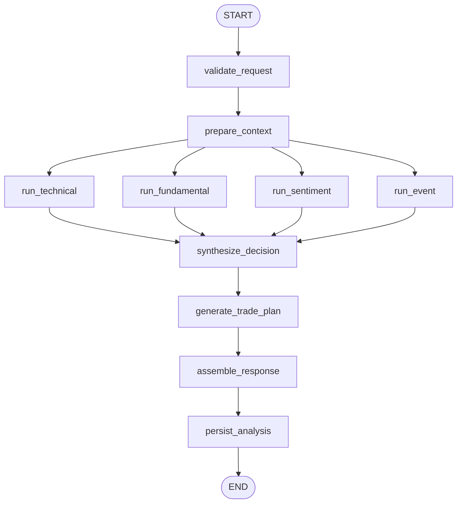

# LangGraph 主图实现说明

## 1. 文档目标

本文只描述当前运行时主图的实现级约束：

- graph 如何在代码里声明
- 节点拓扑、并行扇出/扇入如何工作
- wrapper 如何控制状态写回范围
- reducer 如何保证并行结果可合并
- 后续改 graph 时哪些地方可以改，哪些地方不能乱动

主代码文件：

- `app/graph/builder.py`
- `tests/graph/test_builder.py`

---

## 2. 当前主图拓扑

当前 graph 在 `build_analysis_graph(...)` 中构建，拓扑固定如下：



测试基线见：

- `tests/graph/test_builder.py:test_build_analysis_graph_topology_matches_v1_order`

拓扑含义：

1. 请求规范化必须先于任何上下文准备。
2. 上下文准备必须先于四个分析模块。
3. 四个分析模块之间没有显式依赖，必须允许并行。
4. `synthesize_decision` 必须等待四个模块都完成。
5. `trade_plan` 必须依赖综合结论，不能提前生成。
6. 组装响应必须先于持久化。

---

## 3. graph builder 的职责边界

`build_analysis_graph(...)` 只做四件事：

1. 定义 graph state 类型
2. 注册节点
3. 注册边
4. 注入 repository 与 providers

它不负责：

- 业务规则计算
- provider 取数实现
- response schema 组装细节
- API 错误码映射

实现者改 builder 时应坚持这个边界。

---

## 4. 节点注册方式

### 4.1 普通节点

普通串行节点通过 `_wrap_node(node, *keys)` 包装，例如：

```python
graph.add_node("prepare_context", _wrap_node(prepare_context, "context"))
```

语义：

- 先执行节点函数，拿到完整 `TradePilotState`
- `model_dump(mode="python")`
- 只抽出指定 key 写回 graph

这样做的原因：

- 节点函数便于独立测试
- graph state 只更新必要字段，避免把完整快照重新写回导致并行覆盖

### 4.2 模块节点

分析模块使用 `_wrap_module_node(...)` 包装。

返回 payload 固定为：

```text
{
  "module_results": { "<module>": ... },
  "diagnostics": ...,
  "sources": ...  # 仅 include_sources=True 时
}
```

关键点：

- 模块节点不会把完整状态写回 graph
- 它们只能追加自己的模块结果和诊断信息
- `sources` 只有 provider 启用时才进入 graph merge

这保证了并行分支之间不会互相覆盖。

---

## 5. state reducer 设计

### 5.1 为什么需要 reducer

在 `prepare_context -> 4 个模块` 的并行阶段，多个节点会同时写：

- `module_results`
- `diagnostics`
- `sources`

如果没有 reducer，后写入的分支会覆盖先写入的分支结果。

### 5.2 `module_results` reducer

声明：

```python
module_results: Annotated[dict[str, Any], _merge_dict_updates]
```

行为：

- 基于 key 做浅 merge
- 典型结果为：
  - `technical`
  - `fundamental`
  - `sentiment`
  - `event`

注意：

- 该 reducer 假设每个模块只写自己的 key
- 如果两个分支意外写同一个 key，后写入结果会覆盖前者

### 5.3 `diagnostics` reducer

声明：

```python
diagnostics: Annotated[dict[str, Any], _merge_diagnostics]
```

行为：

- 合并四个诊断列表
- 自动去重

当前适合承载：

- 降级模块集合
- 排除模块集合
- warning 文本
- error 文本

### 5.4 `sources` reducer

声明：

```python
sources: Annotated[list[dict[str, Any]], _merge_sources]
```

行为：

- 以 `(type, name, url)` 去重
- 再按固定 source type 顺序排序

这使得最终 public API 的 `sources` 顺序具备可预测性。

---

## 6. provider 注入方式

`build_analysis_graph(...)` 通过闭包把 provider 注入模块节点：

- `market_data_provider`
- `financial_data_provider`
- `news_data_provider`
- `company_events_provider`
- `macro_calendar_provider`

设计含义：

- graph 本身不创建 provider
- provider 生命周期由 API app state 管理
- builder 只负责把 provider 句柄传入节点

这个边界后续不要打破。不要在节点内部自己 new provider，也不要在 builder 内直接访问配置文件。

---

## 7. 当前 graph 的执行语义

### 7.1 编译

当前通过：

```python
return graph.compile(name="tradepilot_analysis_graph")
```

没有启用：

- checkpoint saver
- interrupt hooks
- streaming
- retries
- conditional edges

### 7.2 调用

API 入口使用：

```python
result = graph.invoke({"request": analyze_request.model_dump(mode="python")})
```

说明：

- graph 输入只要求最小 payload：`request`
- 其余运行时字段由节点逐步补齐
- 这也是 `validate_request` 必须能够生成 `request_id` 的原因

### 7.3 失败行为

当前 graph 没有局部错误恢复机制。

含义：

- 模块内部若选择“降级”，必须在节点内自行吞掉 provider 异常并回写 degraded 结果
- 节点若抛异常，则 graph 直接失败
- API 再统一把 graph 失败映射为 HTTP 错误响应

---

## 8. 当前实现与设计目标的差异

### 8.1 已对齐的部分

- LangGraph 作为唯一编排层
- 固定主链路顺序
- 四分析模块并行
- 决策综合与交易计划分层
- 结果组装后持久化

### 8.2 尚未完全对齐的部分

| 主题 | 当前实现 | 目标方向 |
|---|---|---|
| graph state 明细 | 只保留模块最终聚合结果 | 后续可扩展模块内部中间态，但仍需受控 |
| provider payload 缓存 | 未进入主图 | 后续可在 `provider_payloads` 中沉淀标准化原始输入 |
| 条件分支 | 当前无 conditional edge | 若未来引入，应保持决策层唯一入口不变 |
| 失败恢复 | 只有节点内降级，没有 graph 级重试 | 后续可加 provider 层重试，但不要让 graph 自行猜测重跑 |
| event sources 开关 | 只有两个 provider 都启用才回写 `sources` | 后续若要支持部分 provider，也要重新定义 event 模块契约 |

---

## 9. 改 graph 时的约束

### 9.1 可以改的部分

- 在现有顺序不被破坏的前提下，扩展节点内部实现
- 为现有字段补更强 schema
- 为 reducer 增加更严格的去重或校验逻辑
- 在四个分析模块内部扩展 provider-backed 逻辑

### 9.2 需要谨慎改的部分

- 改节点名
- 改四模块扇出/扇入关系
- 改 `synthesize_decision -> generate_trade_plan` 的因果关系
- 改持久化位置
- 改 reducer 语义

因为这些改动会直接影响：

- `tests/graph/test_builder.py`
- API 行为
- persistence payload 结构

### 9.3 不应做的改动

- 不要让 `trade_plan` 先于 `decision_synthesis`
- 不要让 `assemble_response` 直接从 provider 原始数据拼 response
- 不要把 persistence 移到 API 层外绕过 graph state
- 不要让并行模块写共享可变对象并依赖副作用同步

---

## 10. 最小联调检查项

改动 graph 后至少确认：

1. graph 输入最小仍然只需 `request`
2. `validate_request` 后 `normalized_ticker` 与 `request_id` 已存在
3. 四个模块在 provider 缺失时仍能降级产出
4. `synthesize_decision` 能收到完整四模块 contribution
5. `assemble_response` 能生成合法 `AnalysisResponse`
6. `persist_analysis` 能拿到完整 payload
7. `tests/graph/test_builder.py` 全部通过
